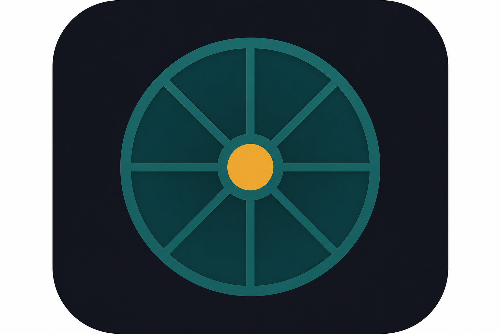

# Integral

> **Tend every area of your life. One honest day at a time.**

[](LICENSE)
[]()
[]()

A local-first desktop app for tracking and tending every area of your life — money, body, burnout prevention, creative work, family, search practice, spiritual development, and emotional wellbeing.

Log in seconds on low-energy days. See your year at a glance. Get guidance when maintenance slips.

**No account. No cloud. Your data stays on your machine.**

<p align="center">
  
</p>

---

## Why Integral exists

Most apps in this space pick one lane:

- **Mood trackers** (Daylio) — fast, but narrow
- **Life OS platforms** (Benji, HALO) — powerful, but overwhelming and cloud-tied
- **Wheel-of-life apps** (LifeWheel) — great snapshot, weak on daily narrative and coaching
- **Journals** (Mini Diarium, Journaler) — private writing, no structured life-area intelligence
- **Fitness loggers** (CC Tracker, Strong) — programs without the rest of your life

Integral combines what actually helps long-arc personal development:

| Layer | What it does |
|-------|----------------|
| **Daily log** | Rating (1–10) + optional checklist, metrics, and notes per category |
| **At-a-glance** | GitHub-style activity grid — see your year in squares, click any day to explore |
| **Intelligence** | Trends, neglected areas, burnout warnings, and category-specific guidance |
| **Fitness** | Official Convict Conditioning, Tibetan Rites, and Explosive Calisthenics progression tables |
| **Privacy** | Local JSON storage; open source; Windows `.exe` |

See [docs/COMPETITIVE_LANDSCAPE.md](docs/COMPETITIVE_LANDSCAPE.md) for competitive research.

---

## Life areas (default categories)

- Money/Freedom
- Body & Presence
- Burnout Prevention & Energy Management
- Creative/Mental Work
- Family/Logistics
- Search Practice
- Spiritual Development
- Emotional Wellbeing

All categories are editable in-app (checklists and metrics).

---

## Features

- **Overview** — contribution calendar, today's stats, guidance highlights, quarterly milestone summary
- **Categories** — log and explore each life area
- **Day explorer** — click any grid square to review or backfill a day
- **Guidance** — coaching from your logs (declining trends, maintenance gaps, plateaus)
- **Graphs** — rating trends, metrics, heatmaps, life balance radar
- **Fitness Hub** — multi-program tracking with official B/I/P standards, smart pre-fill, repeat session, advancement evidence
- **Fitness charts** — step ladders, Tibetan 5-rite lines, EC height trends, volume by program, heatmap, development radar
- **Quarterly milestones** — track Q1–Q4 priorities and completion
- **Export** — life, fitness, and milestones to CSV
- **Backup & restore** — full JSON backup with one-click restore
- **Encryption at rest** — optional passphrase-protected journal (AES via Fernet)
- **First-run onboarding** — quick tour of logging and fitness
- **Weekly summary**, full history, note search (life + fitness), dark mode

---

## Download & run

### Windows users (recommended)

1. Download **`Integral-windows.zip`** from [Releases](https://github.com/earthboundtrev/integral/releases).
2. Unzip and double-click **`Integral.exe`**.

Your journal saves to `%APPDATA%\Integral\data.json`. Back up that file to keep your history.

### From source (developers)

```powershell
.\run.ps1
```

Development data: `data/data.json` in the project folder.

---

## Build `Integral.exe` (maintainers)

```powershell
.\build.ps1
```

→ `dist\Integral\Integral.exe` with app icon embedded.

Single-file build: `.\build-onefile.ps1` → `dist\Integral.exe`

Icon is generated from `assets/integral-icon-source.png` via `scripts/build_icon.py`.

---

## Tech stack

- Python 3 + Tkinter
- Matplotlib
- JSON on disk
- PyInstaller + Pillow (build)

---

## Project structure

```
integral/
├── personal_dev_tracker.py   # Main entry
├── activity_grid.py          # Contribution calendar
├── insights/                 # Guidance engine
├── fitness/                  # Program tracking
├── programs/                 # Official fitness tables
├── assets/                   # App icon
├── docs/                     # Research & launch notes
└── tests/
```

---

## Tests

```powershell
python -m unittest discover -s tests -v
```

---

## Roadmap

Formal plan for closing competitive gaps:

| Priority | Gap | Direction |
|----------|-----|-----------|
| **Sync** | No cloud / multi-device yet (Benji wins) | Optional encrypted sync — opt-in, local-first default |
| **AI** | No AI layer yet (Orakemu, Sinqly, nopy) | Optional local/API-key AI on your logs — no Integral servers |
| **Security** | No encryption at rest (Mini Diarium wins) | Passphrase vault + encrypted journal data |
| **Polish** | Brand behind funded SaaS | Installer, onboarding, screenshots, release UX |

Full phased roadmap: **[docs/ROADMAP.md](docs/ROADMAP.md)**

Also planned: quarterly milestones, CSV export, macOS/Linux builds.

---

## Open source launch

| Item | Value |
|------|--------|
| **Name** | Integral |
| **Tagline** | Tend every area of your life. One honest day at a time. |
| **License** | [MIT](LICENSE) |
| **GitHub About** | Copy from [docs/GITHUB_LAUNCH.md](docs/GITHUB_LAUNCH.md) |

---

## Contributing

Contributions welcome. Open an issue before large changes. Keep the daily log flow fast and the app local-first.

---

## License

[MIT License](LICENSE) — Copyright (c) 2026 Integral contributors.
