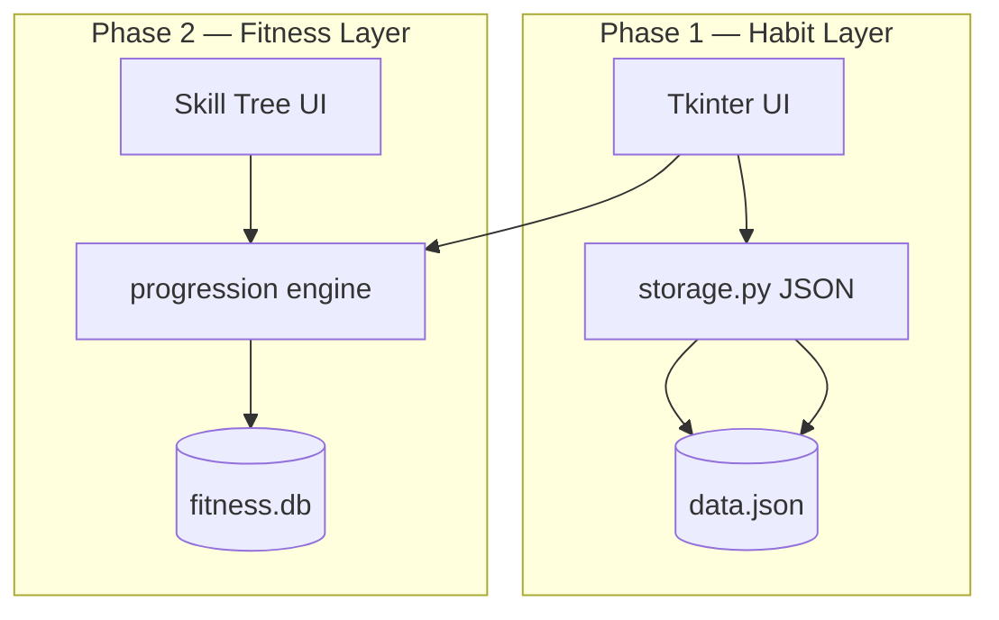

# Product Requirements Document (PRD)

**Product:** Personal Development Tracker  
**Status:** Active  
**Owner:** Human (product); agents implement from specs only  
**Last updated:** 2026-06-27

---

## 1. Executive Summary

A **local-first, lightweight desktop application** for holistic personal development across eight life domains, evolving into a unified progression platform. Phase 1 delivers daily logging, streaks, summaries, and embedded charts. Phase 2 adds a graph-based fitness progression system (Convict Conditioning, Overcoming Gravity, Starting Strength, Explosive Calisthenics, Five Tibetan Rites). Later phases extend the progression graph pattern to non-fitness domains and optional AI coaching.

**Implementation rule:** No feature ships without an approved spec in `docs/specs/`. This PRD is not implemented directly — it decomposes into specs.

## 2. Problem Statement

People tracking personal development across many life areas need:

- Fast, frictionless daily logging (not another heavy SaaS app)
- Visual feedback (graphs, streaks, summaries) without cloud dependency
- Long-term progression through structured programs (especially fitness) where skills across books connect logically

## 3. Goals & Success Metrics

| Goal | Metric |
|------|--------|
| Fast startup | Dashboard visible < 2s (matplotlib not loaded) |
| Fast daily use | < 60s to log one category |
| Honest tracking | Rating + checklist + metrics + notes per category |
| Visual progress | Today / week / month summaries + charts |
| Fitness depth | Unified skill tree across training systems |
| Classic desktop | Standalone `.exe`, no Python install (ADR-009) |
| Agent-buildable | 100% of code generated from specs + ADRs |

## 4. Users

- **Primary:** Single user on desktop (Windows/macOS/Linux via Python)
- **Future:** Same user with optional local AI coach (opt-in, offline-capable recommendations without LLM)

## 5. Product Phases (Epics)

### Epic A — Phase 1: Daily Life Tracker (MVP)

| ID | Feature | Spec |
|----|---------|------|
| A1 | Dashboard with 8 category cards, streaks | `specs/phase-1/001-dashboard.md` |
| A2 | Daily log dialog (rating, checklist, metrics, notes) | `specs/phase-1/002-daily-logging.md` |
| A3 | Graphs & Summaries window | `specs/phase-1/003-graphs-summaries.md` |
| A4 | Full history view | `specs/phase-1/004-history.md` |
| A5 | Storage layer + default categories | `specs/phase-1/005-storage-and-seed.md` |
| A6 | Settings placeholder | `specs/phase-1/006-settings-placeholder.md` |

### Epic B — Phase 2: Fitness Progression Graph

| ID | Feature | Spec |
|----|---------|------|
| B1 | Exercise + ProgressionEdge + UserProgress entities (SQLite) | `specs/phase-2/001-fitness-dag-core.md` |
| B2 | Mastery evaluator + unlock engine | `specs/phase-2/002-mastery-unlock.md` |
| B3 | Seed data: CC1 push progressions (pilot) | `specs/phase-2/003-seed-cc1-push.md` |
| B4 | Workout logging UI | `specs/phase-2/004-workout-logging.md` |
| B5 | Skill tree visualization | `specs/phase-2/005-skill-tree-ui.md` |
| B6 | Body composition log (weight, measurements, photos) | `specs/phase-2/006-body-composition.md` |
| B7 | Expand seeds: OG, SS, EC, FTR | `specs/phase-2/007-seed-remaining-books.md` |

### Epic D — Distribution (Infra)

| ID | Feature | Spec |
|----|---------|------|
| D1 | Standalone Windows EXE (local-first) | `specs/infra/001-standalone-exe.md` |

### Epic C — Phase 3: Cross-Domain & Coach

| ID | Feature | Spec |
|----|---------|------|
| C1 | Progression graph pattern for 1 non-fitness category | TBD |
| C2 | Life-balance radar chart (8 axes) | `specs/phase-3/001-radar-recommendations.md` (done) |
| C3 | Local rule-based "what's next" recommendations | `specs/phase-3/001-radar-recommendations.md` (done) |
| C4 | Optional LLM coach (opt-in) | TBD (partially shipped outside this table) |
| C5 | Creative writing projects library + local storage | `specs/phase-3/002-creative-projects-library.md` (done) — [GitHub #1](https://github.com/earthboundtrev/integral/issues/1) |
| C6 | Inspiration + manuscript writing windows | `specs/phase-3/003-creative-writing-windows.md` (done) — [GitHub #2](https://github.com/earthboundtrev/integral/issues/2) |
| C7 | Tie writing projects to Creative/Mental Work | `specs/phase-3/004-creativity-writing-integration.md` (draft) — [GitHub #3](https://github.com/earthboundtrev/integral/issues/3) |
| C8 | Deep Work Mode (focus timer + reduced chrome) | `specs/phase-3/005-deep-work-mode.md` (draft) — [GitHub #4](https://github.com/earthboundtrev/integral/issues/4) |

## 6. Life Domains (8 Categories)

Fixed names — see ADR-005. Each has checklist, metrics, daily rating 1–10, notes:

1. Money/Freedom  
2. Body & Presence  
3. Burnout Prevention & Energy Management  
4. Creative/Mental Work  
5. Family/Logistics  
6. Search Practice  
7. Spiritual Development  
8. Emotional Wellbeing  

## 7. Non-Goals

- Cloud sync or online accounts (local profiles only — ADR-008)
- Mobile native apps
- Social / leaderboards
- Electron or heavy web stacks
- Rewriting in C++ (see ADR-001)

## 7b. Distribution Goals

- **Standalone EXE** for Windows — double-click, no Python (ADR-009)
- User data always under `~/.personal_dev_tracker/` — survives EXE updates

## 8. Technical Constraints (see ADRs)

- Python 3 + Tkinter/ttk
- Local data: `~/.personal_dev_tracker/`
- matplotlib lazy-loaded only (ADR-003)
- Fitness graph in SQLite when Phase 2 begins (ADR-004)
- Progression model is DAG (ADR-006)

## 9. Architecture Overview

## 10. Spec Backlog Priority

Implement in order unless a spec declares dependencies:

1. `005-storage-and-seed` (foundation)
2. `001-dashboard`
3. `002-daily-logging`
4. `003-graphs-summaries`
5. `004-history`
6. `006-settings-placeholder`
7. Phase 2 specs in numeric order

## 11. Revision History

| Date | Change |
|------|--------|
| 2026-06-27 | Initial PRD; spec-driven structure |
