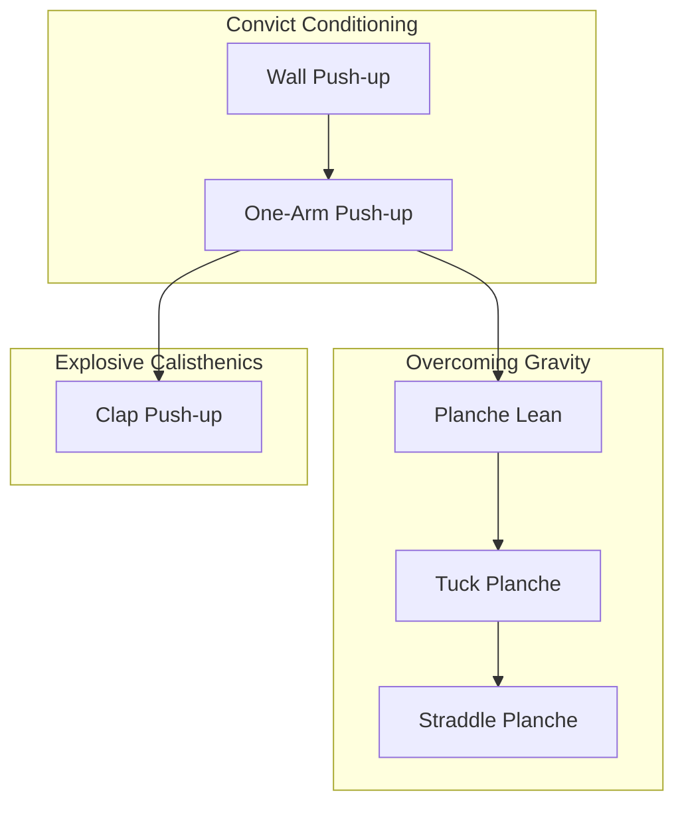

# Graph-Based Progression Model

## Philosophy

> Treat every exercise from every system as a node in one big directed graph. Define clear relationships (edges) between them. Track user progress against mastery criteria on each node. Use the graph to power visualization and intelligent recommendations.

This turns separate linear programs (CC steps, OG progressions, Starting Strength lifts) into one interconnected skill tree.

## Conceptual Diagram



## Core Entities

### Exercise

Master list of every movement from all books.

| Field | Type | Description |
|-------|------|-------------|
| `id` | string (UUID) | Stable identifier |
| `name` | string | Display name |
| `source_book` | enum/string | CC1, CC2, EC, OG, SS, FTR, etc. |
| `family` | enum | push, pull, core, legs, skill, mobility, … |
| `mastery_criteria` | JSON | What "mastered" means (see below) |
| `metadata` | JSON | Optional: equipment, difficulty tier, video ref |

### ProgressionEdge

Directed relationship between two exercises.

| Field | Type | Description |
|-------|------|-------------|
| `from_exercise_id` | string | Prerequisite or related prior skill |
| `to_exercise_id` | string | Unlocked or recommended next skill |
| `unlock_condition` | JSON | When edge activates (see below) |
| `edge_type` | enum | `prerequisite`, `recommended`, `alternative` |

Edges may be **within** a program or **across** programs. The graph must remain a **DAG** for prerequisite chains (detect cycles on insert).

### UserExerciseProgress

Per-user state on each exercise node.

| Field | Type | Description |
|-------|------|-------------|
| `exercise_id` | string | FK to Exercise |
| `status` | enum | `locked`, `available`, `in_progress`, `mastered` |
| `current_step` | int? | For stepped progressions (e.g. CC step 1–10) |
| `best_reps` | int? | Best set performance |
| `best_hold_time` | float? | Seconds, for static holds |
| `best_weight` | float? | For barbell movements (SS) |
| `last_logged_at` | datetime | |
| `achieved_at` | datetime? | When mastery criteria first met |

### MasteryCriteria (JSON on Exercise)

Flexible per movement type:

### Step progression (seed file)

Each seed file declares how steps unlock within that program family:

| `step_progression` | Programs | Behavior |
|--------------------|----------|----------|
| `sequential` | CC1 Big Six, CC2 ladders, OG charts, EC PARC chains | Only step 1 available; master step *N* to unlock *N+1* |
| `parallel` | Starting Strength main lifts, Five Tibetan Rites, independent CC2 samples | All movements available from the start — no prerequisite chain |

Cross-book `recommended` edges never hard-block logging.

```json
{ "sets": 3, "reps": 5 }
{ "sets": 3, "hold_seconds": 10 }
{ "sets": 3, "reps": 5, "weight_kg": 60 }
{ "sessions": 5, "min_rating": 8 }
```

Evaluator checks logged performance against criteria; on success → `mastered` + unlock downstream nodes.

### unlock_condition (JSON on ProgressionEdge)

```json
{ "requires": "mastered" }
{ "requires": "in_progress", "min_step": 5 }
{ "requires_any": ["exercise_id_a", "exercise_id_b"] }
```

## Progression Flow

1. User logs a workout entry linked to one or more exercises.
2. System compares performance to `mastery_criteria`.
3. If criteria met → mark `UserExerciseProgress` as `mastered`.
4. Traverse outgoing `ProgressionEdge` records from that node.
5. For each edge whose `unlock_condition` is satisfied → set target to `available`.
6. UI skill tree and AI coach read current graph state + user progress.

## Skill Tree Views

- **By family** — Push Mastery Tree, Pull Mastery Tree, etc.
- **By source** — filter to one book/program
- **Unified** — all systems, cross-links visible
- **Personal roadmap** — highlighted path from AI coach (future)

## Extending to Other Categories

The same pattern applies outside fitness:

| Domain | Node | Edge | Mastery |
|--------|------|------|---------|
| Creative work | Project / skill (e.g. "daily writing") | Prerequisites | Streak + output criteria |
| Spiritual | Practice type | Progression path | Session count + self-rating |
| Money | Financial habit | Dependency | Consistency + metric thresholds |

Fitness is first because movements have **objective, book-defined criteria**. Softer domains use the same graph machinery with subjective or streak-based criteria.

## AI Coach Integration (Future)

The graph is AI-friendly:

- Nodes + edges = structured context
- User progress = current state vector
- Coach prompt: "Given mastered nodes X, Y, suggest next 3 exercises respecting unlock graph and user injuries/preferences"

Keep coach **optional** and **offline-capable** — local graph traversal for recommendations without LLM; LLM for natural-language roadmaps when user opts in.

## Data Integrity Rules

- No cycles in `prerequisite` edges (validate on write).
- `mastered` implies all hard prerequisites were `mastered`.
- Deleting an exercise soft-deletes; never orphan user progress silently.
- Seed data (CC/OG/SS exercises) ships as versioned JSON/SQLite migrations.
