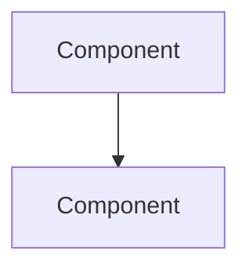

# Feature Spec Template

Copy to `docs/specs/<phase>/NNN-short-name.md`. One spec ≈ one PR.

---

```markdown
---
id: SPEC-001
title: Short feature name
phase: phase-1 | phase-2 | phase-3
status: draft | approved | in_progress | done | blocked
prd_refs: [PRD §3.2]
adr_refs: [ADR-001, ADR-003]
---

# SPEC-NNN: Title

## 1. Target (Outcome)

What exactly are we building? One paragraph. User-visible result when done.

**User story:** As a [role], I want [capability], so that [benefit].

## 2. Boundary (Scope)

### In scope
- Bullet list of what this spec covers

### Out of scope
- Explicit exclusions (prevents agent scope creep)

### Files allowed to create/modify
- `path/to/file.py` — reason
- List every file. Agent must not touch files not listed without spec amendment.

### Files forbidden
- e.g. `docs/adr/*` unless spec explicitly includes doc updates

### Dependencies
- Other specs that must be `done` first (by id)
- New pip packages (require ADR amendment if not in constitution)

## 3. Design

### Architecture (mermaid)



### Data changes
- Schema additions, JSON shape changes, migrations

### UI changes
- Window sizes, widgets, navigation, copy

## 4. Acceptance Criteria (EARS)

Use [EARS syntax](https://alistairmavin.com/ears/) — natural language, testable.

| ID | Criterion |
|----|-----------|
| AC-1 | **When** [trigger], **the** [system] **shall** [behavior]. |
| AC-2 | **If** [condition], **then** [system] **shall** [behavior]. |
| AC-3 | **While** [state], **the** [system] **shall** [behavior]. |

## 5. Verification (Proof)

How to prove the boundary was met and target achieved.

| AC ID | Verification method |
|-------|---------------------|
| AC-1 | `python -m pytest tests/test_foo.py -k test_name` OR manual: step 1, 2, 3 → expect X |
| AC-2 | ... |

### Performance checks (if applicable)
- Cold start: `python -X importtime tracker.py` — matplotlib not in top imports until graphs opened
- Save latency: < 100ms with 1 year of sample data

## 6. Tasks

Numbered, incremental, each ends with wiring — no orphaned code.

- [ ] T1: [action] — satisfies AC-1
- [ ] T2: [action] — satisfies AC-2
- [ ] T3: Wire T1+T2 into [entry point] — satisfies AC-3

## 7. Loop (Agent retry rules)

- If AC fails after implementation, diagnose spec vs code before retrying.
- Max 3 implementation retries per task; then set status `blocked` and ask human.
- May ask human questions when spec is ambiguous; do not guess.

## 8. Revision History

| Date | Author | Change |
|------|--------|--------|
| YYYY-MM-DD | human/agent | Initial draft |
```

---

## Six Spec Essentials (Checklist)

Before setting `status: approved`, confirm:

- [ ] **Target** — clear outcome
- [ ] **Boundary** — in/out scope + file list
- [ ] **Proof** — every AC has verification method
- [ ] **Loop** — retry and escalation rules
- [ ] **Design** — mermaid or data model where non-trivial
- [ ] **Tasks** — ordered, incremental, no big-bang jumps
