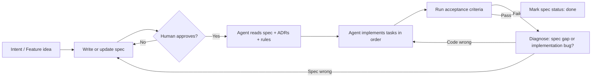

# Spec-Driven Development Workflow

> Based on [Gauntlet Night School: Specs, ADRs, and Building Loops](https://youtu.be/ayHy7YHddak) — Ash Tilawat

## Philosophy

**The spec is the contract. Code is derivative.**

If the code is wrong, fix the spec first — then re-run the agent. Never patch code in ways that drift from the documented contract, or the next agent session will "correct" your hotfix back to broken state.

**The human owns outcomes; agents implement.** You do not write application code. You write and approve specs, ADRs, and acceptance criteria. Agents implement, verify, and loop until criteria pass.

## Document Hierarchy

```
PRD.md                          ← entire product (source of truth for vision)
├── docs/adr/*.md               ← constitution: decisions that must never break
├── docs/specs/<phase>/<id>.md  ← one spec ≈ one PR (shippable unit)
│   ├── requirements (EARS AC)
│   ├── design (mermaid, data, files)
│   └── tasks (numbered, checkbox)
└── code/                       ← generated only from approved specs
```

| Artifact | Scope | Who approves |
|----------|-------|--------------|
| PRD | Whole product, phases, epics | Human (you) |
| ADR | Immutable technical/product decisions | Human |
| Feature spec | One PR-sized deliverable | Human before implement |
| Code | Implementation of one spec | Agent; human reviews via AC |

## The Loop

Every implementation session follows this loop. Do not skip steps.



### Loop requirements (non-negotiable)

1. **Intent** — What user outcome? Why now? Which phase/epic?
2. **Spec** — Target, boundary, files, acceptance criteria, task list, verification commands.
3. **Approve** — Agent must not implement until spec status is `approved`.
4. **Implement** — One task at a time; each task references AC IDs.
5. **Eval** — Every AC must be verifiable (test, command, or manual check with exact steps).
6. **Retry** — If eval fails, agent retries up to 3 times; then stop and ask human.

## Spec Sizing

- **PRD** = whole project. Never implement directly from PRD.
- **Epic** = phase (e.g. Phase 2 Fitness DAG). Break into multiple specs.
- **Spec** = one PR. Completable in one agent session (typically <400 lines changed).
- One story/epic → **multiple specs** is normal on a large codebase.

## Agent Instructions (Factory Harness)

When asked to implement a feature:

1. Read `docs/PRD.md`, all `docs/adr/*.md`, and the specific `docs/specs/**/<spec>.md`.
2. Confirm spec status is `approved`. If `draft`, stop and help finish the spec.
3. Read `.cursor/rules/constitution.mdc` and applicable harness rules.
4. Execute tasks in order from the spec's `tasks.md` section (or embedded Tasks section).
5. After each task, run relevant AC checks before proceeding.
6. On completion, update spec status to `done` and list which ACs were verified how.

When asked to fix a bug:

1. Determine if behavior matches spec. If spec is ambiguous/wrong → update spec first.
2. If spec is correct → fix implementation only within spec's file boundary.

## Greenfield vs Brownfield

| Mode | Approach |
|------|----------|
| Greenfield (now) | PRD defines ~60% skeleton via ordered spec backlog; implement spec-by-spec |
| Brownfield (later) | Each new feature gets its own spec; spec lists exact files to touch |

## Spec Status Values

| Status | Meaning |
|--------|---------|
| `draft` | Being written; agent may help refine, must not implement |
| `approved` | Ready for implementation |
| `in_progress` | Agent actively implementing |
| `done` | All ACs verified |
| `blocked` | Waiting on human decision; add ADR if needed |

## IP Discipline

Specs and ADRs are project IP. When rejecting or revising work:

- Keep the spec; add a `## Revision History` section.
- Never delete acceptance criteria — strike through and replace with dated entry.
