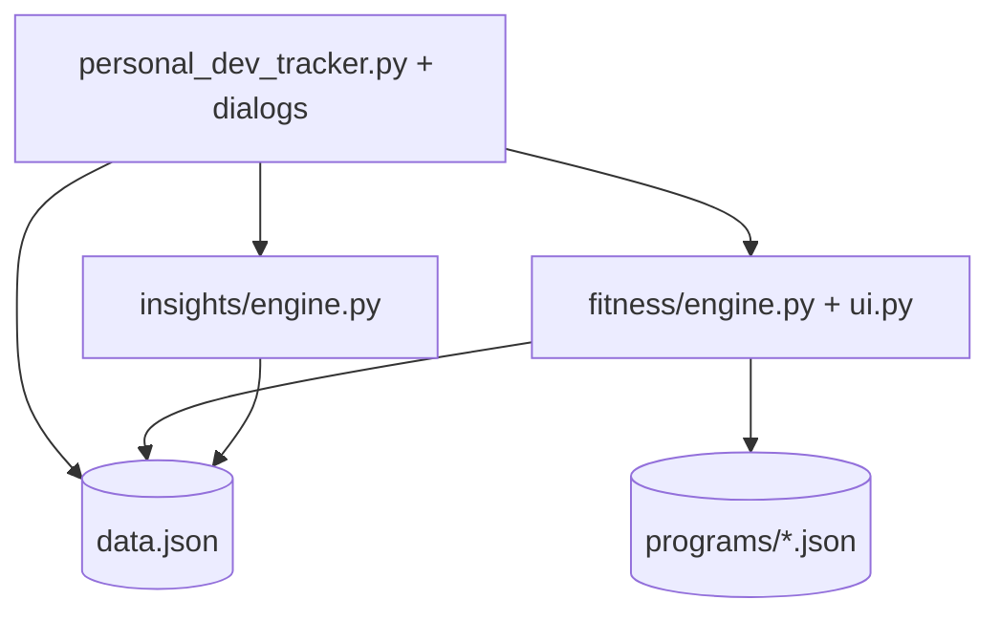

# Integral — Architecture Overview

Canonical entry point for developers and AI agents working on **Integral** (local-first life tracking desktop app).

## System at a glance

Integral is a **Python 3 + Tkinter** desktop application with optional **matplotlib** charts and **PyInstaller** Windows releases.

| Area | Role |
|------|------|
| `personal_dev_tracker.py` | Main app entry — dashboard, logging, settings |
| `activity_grid.py` | GitHub-style contribution calendar |
| `graphs.py` / `fitness_graphs.py` | Matplotlib chart windows |
| `theme.py` | Light/dark theme tokens |
| `paths.py` | Dev vs frozen exe paths (`data.json`, `programs/`, icon) |
| `insights/` | Life-area guidance engine (trends, playbooks) |
| `fitness/` | Program engine + Fitness Hub UI |
| `programs/` | Official fitness progression JSON (read-only at runtime) |
| `assets/` | App icon (`.ico`, source PNG) |
| `tests/` | `unittest` modules |
| `data/` | User journal (`data.json`) — **gitignored** |

**Runtime (dev):** `python personal_dev_tracker.py` or `.\run.ps1`  
**Runtime (release):** `Integral.exe` — data in `%APPDATA%\Integral\data.json`

## Data flow



## Where to put new code

| You're building… | Put it in… |
|------------------|------------|
| New life-area logic / coaching rules | `insights/engine.py` or `insights/playbooks.py` |
| New dashboard surface or dialog | `personal_dev_tracker.py` (split module if file grows) |
| Reusable UI widget | New module at repo root (e.g. `activity_grid.py`) or `fitness/ui.py` pattern |
| Chart / visualization | `graphs.py` or `fitness_graphs.py` |
| Fitness progression rules | `fitness/engine.py` |
| Fitness UI | `fitness/ui.py` |
| Official program tables | `programs/{program-id}.json` |
| Path / bundle / AppData logic | `paths.py` only |
| Unit tests | `tests/test_*.py` |
| Product / competitive / roadmap docs | `docs/` |
| User-facing overview | Root `README.md` (capabilities + tagline only) |

## Schema (`data.json`)

```json
{
  "schema_version": 2,
  "categories": {},
  "entries": { "YYYY-MM-DD": { "Category Name": { "rating", "checklist", "metrics", "notes" } } },
  "settings": { "dark_mode": false },
  "sessions": [],
  "program_state": {},
  "user_levels": {}
}
```

Migration lives in `fitness/engine.py` → `migrate_data()`.

## Boundaries

- **Never** commit `data/` or user journal files.
- **Never** hardcode paths — use `paths.py` (`data_file()`, `programs_dir()`, `bundle_dir()`).
- **Program JSON** is read-only reference data; user progress is in `sessions` + `entries`.
- **Keep daily logging fast** — rating + Save must stay under ~30 seconds UX.
- **Local-first** — no mandatory cloud, accounts, or telemetry (roadmap items are opt-in).

## Tests mirror domains

| Domain | Test file |
|--------|-----------|
| Fitness engine | `tests/test_fitness_engine.py` |
| Insights / guidance | `tests/test_insights_engine.py` |
| New feature | `tests/test_{feature}.py` |

Run: `python -m unittest discover -s tests -v`

## Related docs

- Architecture: `docs/architecture.md`
- Cursor agent rules: `.cursor/rules/` (adapted from SmartAstro workflow)
- Roadmap: `docs/ROADMAP.md`
- Competitive landscape: `docs/COMPETITIVE_LANDSCAPE.md`
- Fitness PRD: `docs/fitness-program-tracking-requirements.md`
- GitHub launch: `docs/GITHUB_LAUNCH.md`
