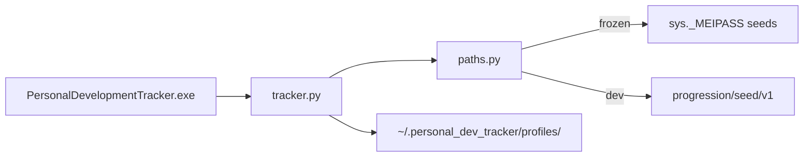

# SPEC-208: Standalone Windows EXE

## 1. Target

Produce a double-clickable Windows `.exe` that runs the full app without Python installed. User data remains local under `~/.personal_dev_tracker/` per profile (ADR-002, ADR-008).

**User story:** As a user, I want to run Personal Development Tracker like a classic desktop program, so that I don't need Python or a terminal.

## 2. Boundary

### In scope
- `paths.py` — `is_frozen()`, `bundle_root()`, `app_resource(path)`
- Update `progression/seed_loader.py` to load seeds from bundle when frozen
- `build/personal_dev_tracker.spec` — PyInstaller spec
- `scripts/build_exe.ps1` — one-command build
- `requirements-build.txt` — PyInstaller only
- `docs/BUILD.md` — how to build and run the EXE
- Smoke test that frozen path resolution works (unit test with monkeypatch)

### Out of scope
- Code signing, installer (MSI/Inno)
- macOS `.app`, Linux AppImage
- Portable mode (data next to EXE) — future spec

### Files allowed
- `paths.py`, `progression/seed_loader.py`, `build/**`, `scripts/**`, `requirements-build.txt`, `docs/BUILD.md`, `tests/test_paths.py`

### Dependencies
- Phase 1 MVP `done`

## 3. Design

## 4. Acceptance Criteria (EARS)

| ID | Criterion |
|----|-----------|
| AC-1 | **When** running from source, **the** app **shall** resolve seed files from the repo `progression/seed/v1/`. |
| AC-2 | **When** `is_frozen()` is true, **the** app **shall** resolve seed files from the PyInstaller bundle root. |
| AC-3 | **When** the EXE runs, **the** app **shall** read/write user data under `~/.personal_dev_tracker/` (not beside the EXE). |
| AC-4 | **The** build script **shall** produce `dist/PersonalDevelopmentTracker.exe` on Windows. |
| AC-5 | **The** runtime `requirements.txt` **shall** not include PyInstaller. |

## 5. Verification

| AC ID | Method |
|-------|--------|
| AC-1–AC-3 | `python -m pytest tests/test_paths.py -v` |
| AC-4 | `powershell scripts/build_exe.ps1` then confirm `dist/PersonalDevelopmentTracker.exe` exists |
| AC-5 | Inspect `requirements.txt` vs `requirements-build.txt` |

## 6. Tasks

- [ ] T1: Add `paths.py`
- [ ] T2: Wire seed_loader to `paths.app_resource`
- [ ] T3: Add PyInstaller spec + build script + BUILD.md
- [ ] T4: Add `tests/test_paths.py`
- [ ] T5: Run build on Windows

## 7. Loop

If matplotlib missing in EXE, add hiddenimports/datas to spec — retry build (max 3).

## 8. Revision History

| Date | Change |
|------|--------|
| 2026-06-27 | Implemented; EXE built to `dist/PersonalDevelopmentTracker.exe` |
