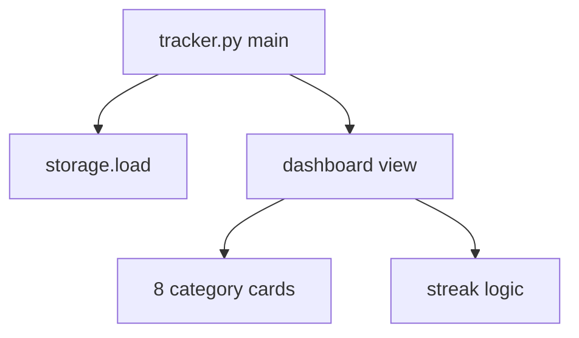

# SPEC-001: Main Dashboard

## 1. Target

Main window showing 8 category cards in a 2-column grid, header with date and overall streak, footer with navigation buttons.

**User story:** As a user, I want a dashboard showing all life domains and my streaks, so that I can see status at a glance and open logging.

## 2. Boundary

### In scope
- `tracker.py` (or `app.py`) entry point + `main()`
- Header: title, today's date, overall streak
- 2-column grid of category cards (name, category streak, today's status)
- Footer: Refresh, View Full History, Graphs & Summaries, Settings (buttons wired in later specs may noop or call placeholders)
- Window: 1200×800, title "Personal Development Tracker"
- Streak calculation (overall + per-category)

### Out of scope
- Log dialog implementation (SPEC-002)
- Graphs/history/settings implementation (SPEC-003, 004, 006)
- matplotlib

### Files allowed
- `tracker.py` (create)
- `dashboard.py` (create, optional split)
- `tests/test_streak.py` (create)

### Dependencies
- SPEC-005 `done`

## 3. Design

### Streak logic
- Consecutive calendar days with ≥1 category logged, ending today
- Category streak: consecutive days that category has an entry
- Sorted dates descending; walk back from today

### Card status colors
- Logged today: `#27AE60`
- Not logged: `#7F8C8D`
- Streak label: `#E67E22`

## 4. Acceptance Criteria (EARS)

| ID | Criterion |
|----|-----------|
| AC-1 | **When** the app starts, **the** main window **shall** display within 2 seconds without importing matplotlib. |
| AC-2 | **The** dashboard **shall** show exactly 8 category cards matching ADR-005 names. |
| AC-3 | **When** today has an entry for a category, **the** card **shall** show rating and green status text. |
| AC-4 | **When** today has no entry, **the** card **shall** show "Not logged today" in gray. |
| AC-5 | **The** header **shall** show overall streak in days based on consecutive logged dates ending today. |
| AC-6 | **Each** card **shall** show a per-category streak. |
| AC-7 | **The** footer **shall** contain four buttons: Refresh, View Full History, Graphs & Summaries, Settings. |
| AC-8 | **When** Refresh is clicked, **the** dashboard **shall** reload data and redraw. |

## 5. Verification

| AC ID | Method |
|-------|--------|
| AC-1 | `python -X importtime tracker.py` — no matplotlib in first 50 lines of importtime output; manual launch |
| AC-2–AC-8 | `pytest tests/test_streak.py`; manual: launch app, verify layout |
| AC-7 | Manual: four buttons visible |

## 6. Tasks

- [ ] T1: Create `tracker.py` with `PersonalDevelopmentTracker` class skeleton, wire `storage.load()`
- [ ] T2: Implement `get_streak(category=None)` with tests
- [ ] T3: Build `create_dashboard()` — header, grid, footer
- [ ] T4: Implement `create_category_card()` with status colors
- [ ] T5: Wire Refresh to `create_dashboard()`
- [ ] T6: Add placeholder commands for History/Graphs/Settings (messagebox "coming soon" OK until those specs)

## 7. Loop

If startup >2s, check matplotlib not imported. Max 3 retries.

## 8. Revision History

| Date | Change |
|------|--------|
| 2026-06-27 | Initial approved spec |
