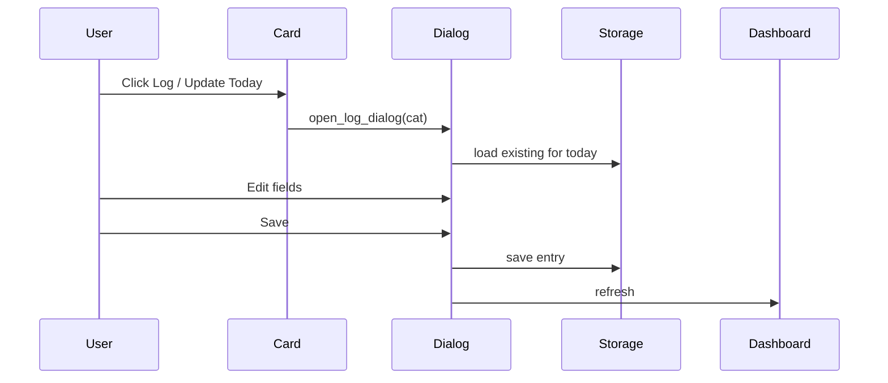

# SPEC-002: Daily Logging Dialog

## 1. Target

Modal dialog to log or update today's entry for a category: rating 1–10, checklist, typed metrics, notes.

**User story:** As a user, I want to log my daily progress for a life domain, so that I can track ratings, habits, metrics, and journal notes.

## 2. Boundary

### In scope
- "Log / Update Today" button on each card opens dialog
- Modal: 540×720, transient + grab_set
- Fields: date (today), rating spinbox 1–10, dynamic checklist from category, dynamic metrics (number entry or rating spinbox), scrolled notes
- Pre-fill from existing entry if present
- Save persists via storage, closes dialog, refreshes dashboard, shows confirmation

### Out of scope
- Editing past dates
- Custom category editor

### Files allowed
- `tracker.py` or `logging.py`
- `tests/test_logging.py`

### Dependencies
- SPEC-001 `done`, SPEC-005 `done`

## 3. Design



### Saved entry shape
```json
{
  "rating": 7,
  "checklist": { "item text": true },
  "metrics": { "Metric name": 7.5 },
  "notes": "string"
}
```

## 4. Acceptance Criteria (EARS)

| ID | Criterion |
|----|-----------|
| AC-1 | **When** user clicks "Log / Update Today", **the** modal dialog **shall** open for that category only. |
| AC-2 | **The** dialog **shall** display all checklist items from category definition. |
| AC-3 | **The** dialog **shall** render number metrics as Entry and rating metrics as Spinbox 1–10. |
| AC-4 | **When** an entry exists for today, **the** dialog **shall** pre-fill all fields. |
| AC-5 | **When** user saves, **the** entry **shall** persist to `data.json` and dashboard **shall** update without restart. |
| AC-6 | **When** user cancels, **the** dialog **shall** close without saving changes. |
| AC-7 | **The** notes field **shall** support multi-line text via ScrolledText. |

## 5. Verification

| AC ID | Method |
|-------|--------|
| AC-1–AC-7 | `pytest tests/test_logging.py` with temp data dir; manual smoke test |

## 6. Tasks

- [ ] T1: Implement `open_log_dialog(cat_name)` with dynamic checklist/metrics
- [ ] T2: Implement `save_log()` merging into `entries[date][category]`
- [ ] T3: Wire Save/Cancel buttons
- [ ] T4: On save: `storage.save()`, destroy dialog, `messagebox.showinfo`, `create_dashboard()`
- [ ] T5: Add tests with mocked/minimal tk or extracted save logic

## 7. Loop

Extract pure save logic to test without full GUI if tk tests flaky.

## 8. Revision History

| Date | Change |
|------|--------|
| 2026-06-27 | Initial approved spec |
