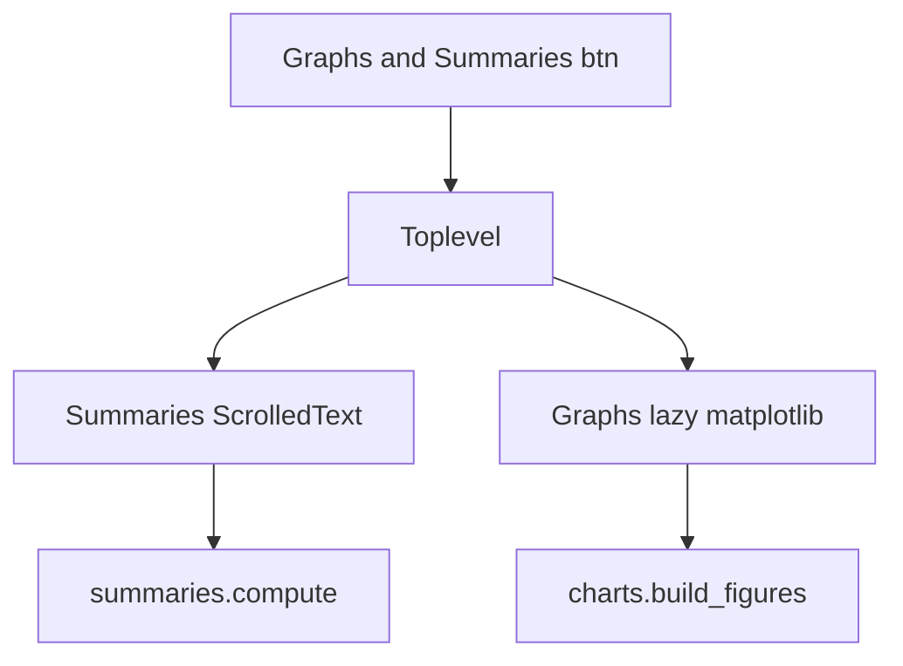

# SPEC-003: Graphs & Summaries Window

## 1. Target

Toplevel window with tabbed Summaries (text) and Graphs (embedded matplotlib charts).

**User story:** As a user, I want to see today/week/month stats and charts of my progress, so that I can understand trends without exporting data.

## 2. Boundary

### In scope
- Opened from footer "Graphs & Summaries" button
- Window 1100×750, `ttk.Notebook` with two tabs
- **Summaries tab:** Today, This Week (7d), Last 30 Days — avg rating, active days, categories logged, total notes count where applicable
- **Graphs tab:** (1) 30-day daily average rating line chart, (2) all-time per-category average bar chart
- matplotlib imported ONLY inside graph tab builder (ADR-003)
- No PNG files written to disk

### Out of scope
- Radar chart, metric trends, fitness skill tree (later specs)
- Export images

### Files allowed
- `charts.py` (create)
- `summaries.py` (create)
- `tracker.py` (wire button)
- `tests/test_summaries.py`

### Dependencies
- SPEC-001 `done`, SPEC-005 `done`

## 3. Design

## 4. Acceptance Criteria (EARS)

| ID | Criterion |
|----|-----------|
| AC-1 | **When** app starts, **the** process **shall not** import matplotlib. |
| AC-2 | **When** user opens Graphs tab, **the** system **shall** lazy-import matplotlib and render two charts. |
| AC-3 | **The** Summaries tab **shall** show sections: TODAY, THIS WEEK, LAST 30 DAYS. |
| AC-4 | **When** no entries exist, **the** summaries **shall** state no data; charts **shall** show "No data yet" placeholder. |
| AC-5 | **When** entries exist, **the** 30-day line chart **shall** plot daily mean rating across categories. |
| AC-6 | **When** entries exist, **the** bar chart **shall** show mean rating per category all-time. |
| AC-7 | **The** system **shall not** write chart image files to disk during normal operation. |

## 5. Verification

| AC ID | Method |
|-------|--------|
| AC-1 | `python -X importtime tracker.py` |
| AC-2–AC-7 | `pytest tests/test_summaries.py`; manual open Graphs tab |
| AC-3 | Manual read Summaries text |

## 6. Tasks

- [ ] T1: Create `summaries.py` with aggregation functions (pure, testable)
- [ ] T2: Create `charts.py` with lazy matplotlib figure builders
- [ ] T3: Implement `show_graphs_and_summaries()` with Notebook
- [ ] T4: Wire footer button in tracker
- [ ] T5: Tests for summary math with fixture data

## 7. Loop

If AC-1 fails, move all matplotlib imports into `charts.py` functions only.

## 8. Revision History

| Date | Change |
|------|--------|
| 2026-06-27 | Initial approved spec |
