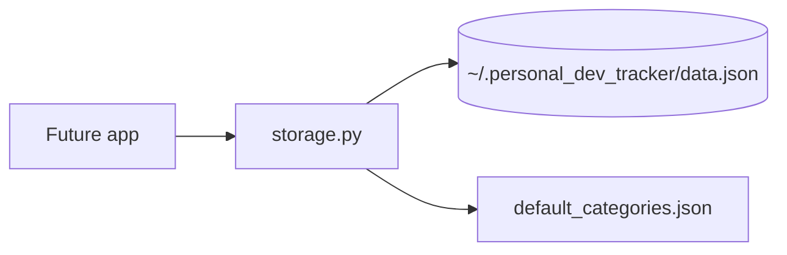

# SPEC-005: Storage Layer and Default Categories

## 1. Target

Provide a `storage` module that loads/saves user data to `~/.personal_dev_tracker/data.json` and ships default definitions for all 8 life-domain categories. All other Phase 1 specs depend on this.

**User story:** As a user, I want my data persisted locally with sensible defaults, so that the app remembers my categories and entries across sessions.

## 2. Boundary

### In scope
- `storage.py` with load, save, path helpers
- Default category definitions (checklist + metrics) for all 8 categories per PRD
- Auto-create data directory on first run
- Atomic save (write temp file → rename)

### Out of scope
- UI, charts, SQLite, settings editor

### Files allowed
- `storage.py` (create)
- `data/default_categories.json` (create, optional seed file)
- `tests/test_storage.py` (create)

### Files forbidden
- `tracker.py` / `app.py` until SPEC-001 wires UI

### Dependencies
- None (first spec to implement)

## 3. Design



### Data shape

```json
{
  "categories": { "<Category Name>": { "checklist": [...], "metrics": [...] } },
  "entries": { "YYYY-MM-DD": { "<Category>": { "rating", "checklist", "metrics", "notes" } } }
}
```

Default categories MUST match ADR-005 names and include metrics/checklists from existing project docs (`docs/DATA_MODEL.md`).

## 4. Acceptance Criteria (EARS)

| ID | Criterion |
|----|-----------|
| AC-1 | **When** the data directory does not exist, **the** storage layer **shall** create `~/.personal_dev_tracker/` and initialize `data.json` with default categories and empty entries. |
| AC-2 | **When** `data.json` exists, **the** storage layer **shall** load categories and entries without data loss. |
| AC-3 | **When** save is called, **the** storage layer **shall** write atomically (no partial file on crash). |
| AC-4 | **The** default categories **shall** include exactly 8 categories matching ADR-005 with at least one checklist item and one metric each. |
| AC-5 | **The** storage module **shall** have zero non-stdlib imports. |

## 5. Verification

| AC ID | Method |
|-------|--------|
| AC-1 | `pytest tests/test_storage.py::test_creates_dir_and_defaults` |
| AC-2 | `pytest tests/test_storage.py::test_roundtrip_load_save` |
| AC-3 | `pytest tests/test_storage.py::test_atomic_save` |
| AC-4 | `pytest tests/test_storage.py::test_eight_categories` |
| AC-5 | Inspect `storage.py` imports; `python -c "import storage"` |

## 6. Tasks

- [ ] T1: Create `storage.py` with `get_data_path()`, `load()`, `save()`, `ensure_data_dir()`
- [ ] T2: Embed or load default categories for all 8 domains
- [ ] T3: Implement atomic save via temp file + `os.replace`
- [ ] T4: Add `tests/test_storage.py` covering AC-1 through AC-4
- [ ] T5: Verify all tests pass

## 7. Loop

Max 3 retries per failing test. If category content disputed, read `docs/DATA_MODEL.md` and ADR-005.

## 8. Revision History

| Date | Change |
|------|--------|
| 2026-06-27 | Initial approved spec |
