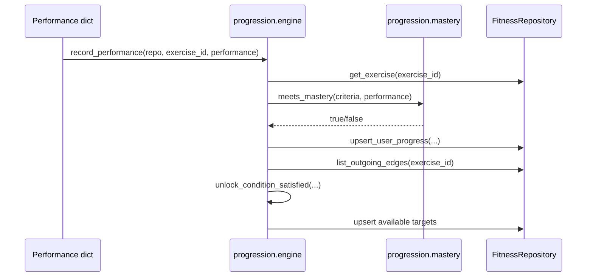

# SPEC-202: Mastery Evaluator and Unlock Engine

## 1. Target

Add pure-Python logic that evaluates workout performance against an exercise's JSON `mastery_criteria`, marks the exercise `mastered` when criteria are met, and unlocks outgoing progression targets when their `unlock_condition` is satisfied.

**User story:** As a user, I want completing an exercise standard to unlock the next appropriate exercises, so that the fitness graph can guide progression automatically.

## 2. Boundary

### In scope
- Criteria evaluation for numeric thresholds: `sets`, `reps`, `hold_seconds`, `weight_kg`, `sessions`, `min_rating`
- `record_performance()` orchestration: evaluate → update `UserExerciseProgress` → unlock downstream nodes
- Unlock conditions:
  - `{ "requires": "mastered" }`
  - `{ "requires": "in_progress", "min_step": N }`
  - `{ "requires_any": ["exercise_id_a", "exercise_id_b"] }`
- Repository helpers to read user progress and outgoing edges

### Out of scope
- Workout session/set storage
- UI
- Seed data
- AI coaching

### Files allowed
- `progression/mastery.py` (create)
- `progression/engine.py` (create)
- `progression/db.py` (modify)
- `progression/__init__.py` (modify)
- `tests/progression/test_mastery_unlock.py` (create)
- `docs/specs/phase-2/002-mastery-unlock.md` (this spec)
- `docs/specs/README.md` (status row)

### Dependencies
- SPEC-201 `done`

## 3. Design



### Performance input shape

```python
{"sets": 3, "reps": 5}
{"sets": 3, "hold_seconds": 10}
{"sets": 3, "reps": 5, "weight_kg": 60}
{"sessions": 5, "rating": 8}
```

Criteria are threshold-based: performance must be greater than or equal to every required numeric field.

## 4. Acceptance Criteria (EARS)

| ID | Criterion |
|----|-----------|
| AC-1 | **When** performance meets all numeric mastery criteria, **the** evaluator **shall** return true. |
| AC-2 | **When** performance misses any numeric mastery criterion, **the** evaluator **shall** return false. |
| AC-3 | **When** `record_performance` receives mastered performance, **the** system **shall** set that exercise progress to `mastered` with `achieved_at`. |
| AC-4 | **When** an outgoing edge requires `mastered`, **the** system **shall** set the target exercise progress to `available` if it is not already `in_progress` or `mastered`. |
| AC-5 | **When** an outgoing edge requires `in_progress` with `min_step`, **the** system **shall** unlock the target only when current step is at least that value. |
| AC-6 | **When** an unlock condition uses `requires_any`, **the** system **shall** unlock when any listed exercise is `mastered`. |
| AC-7 | **The** mastery/unlock modules **shall** have no Tkinter imports. |

## 5. Verification

| AC ID | Method |
|-------|--------|
| AC-1–AC-7 | `python -m pytest tests/progression/ -v` |

## 6. Tasks

- [ ] T1: Create `progression/mastery.py` with `meets_mastery(criteria, performance)`
- [ ] T2: Add repository helpers: `get_user_progress`, `list_outgoing_edges`
- [ ] T3: Create `progression/engine.py` with `record_performance` and unlock-condition logic
- [ ] T4: Add tests for AC-1 through AC-7
- [ ] T5: Run full test suite and update spec status

## 7. Loop

- If unlock behavior is ambiguous, prefer preserving stronger user states (`mastered` and `in_progress` are not downgraded to `available`).
- Max 3 retries per failing progression test before setting status `blocked`.

## 8. Verification Notes

Verified 2026-06-27 with:

```bash
python -m pytest tests/ -v
```

Result: 24 passed.

## 9. Revision History

| Date | Change |
|------|--------|
| 2026-06-27 | Initial approved spec |
| 2026-06-27 | Implemented mastery evaluator and unlock engine; marked done after tests passed |
