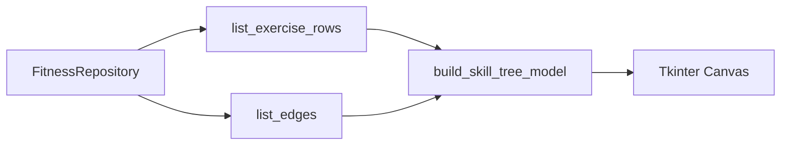

# SPEC-205: Fitness Skill Tree Visualization

## 1. Target

Add a lightweight Tkinter skill tree view that renders the active profile's fitness DAG as connected nodes colored by progress status.

**User story:** As a user, I want to see the exercise progression as a visual tree, so that I understand where I am and what comes next.

## 2. Boundary

### In scope
- `skill_tree.py` with pure layout helpers and Tkinter Canvas renderer
- Skill Tree button in the Fitness Progress window
- CC1 push chain visible as connected nodes
- Node colors for `locked`, `available`, `in_progress`, `mastered`
- Uses active profile's `fitness.db`; seeds CC1 if empty

### Out of scope
- Interactive pan/zoom
- Mermaid export
- Non-fitness graphs
- matplotlib/networkx/graphviz dependencies

### Files allowed
- `skill_tree.py`
- `fitness_ui.py`
- `tests/test_skill_tree.py`
- `docs/specs/phase-2/005-skill-tree-ui.md`
- `docs/specs/README.md`
- `README.md`

### Dependencies
- SPEC-201, SPEC-202, SPEC-203, SPEC-204 `done`

## 3. Design

## 4. Acceptance Criteria (EARS)

| ID | Criterion |
|----|-----------|
| AC-1 | **When** the skill tree opens with an empty DB, **the** system **shall** seed CC1 push data. |
| AC-2 | **The** skill tree model **shall** include one node per exercise and one edge per prerequisite edge. |
| AC-3 | **When** an exercise is mastered, **the** node **shall** use the mastered color. |
| AC-4 | **When** mastery unlocks the next exercise, **the** target node **shall** use the available color. |
| AC-5 | **The** skill tree module **shall not** import matplotlib, graphviz, networkx, or tkinter at module import time. |

## 5. Verification

| AC ID | Method |
|-------|--------|
| AC-1–AC-5 | `python -m pytest tests/test_skill_tree.py -v` |

## 6. Tasks

- [ ] T1: Add skill tree model helpers
- [ ] T2: Add Tkinter Canvas renderer with legend
- [ ] T3: Wire Fitness Progress button
- [ ] T4: Add tests and run full suite

## 8. Revision History

| Date | Change |
|------|--------|
| 2026-06-27 | Implemented skill tree visualization; 42 tests passed |
