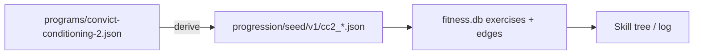

# SPEC-210: Full CC2 progression seeds

## 1. Target (Outcome)

Convict Conditioning 2 ladders that already exist in the Hub reference file become real progression DAG exercises (hangs, calves, fingertip pushups, flags, neck bridges, Trifecta) so the skill tree / logging UI matches CC1 depth.

**User story:** As a CC2 trainee, I want hangs, calf raises, and the other CC2 series available in progressive logging—not only a five-node sample.

## 2. Boundary (Scope)

### In scope
- Seed JSON under `progression/seed/v1/` derived from `programs/convict-conditioning-2.json` step tables (B/I/P → mastery_criteria)
- Families: hang progressions, fingertip pushups, clutch flag, press flag, neck bridges, calf training, Trifecta bridge hold / L-hold / twist
- Update `seed_loader.py` / tests; retire or replace `cc2_sample.json` tip-only sample
- Video catalog stubs optional where URLs exist
- Optional generator script that maps Hub → seeds (no invented standards)

### Out of scope
- Inventing hidden steps not in Hub/book tables
- Strong Medicine DAG (follow-up ticket)
- Changing Hub JSON standards without book verification
- Soft-deleting orphan tip-sample nodes already in an existing user `fitness.db` (new installs get clean 152; upgraders gain new ladders and may keep unused tip keys)

### Files allowed
- `progression/seed/v1/cc2_*.json` (new)
- `progression/seed/v1/cc2_sample.json` (remove or slim)
- `progression/seed/v1/exercise_videos.json` (CC2 key remaps OK)
- `progression/seed_loader.py`
- `progression/db.py` (schema-init cache for seed performance)
- `progression/video_catalog.py` (stubs OK)
- `scripts/generate_cc2_seeds.py`
- `tests/**` fitness/seed tests
- `docs/specs/README.md`, `docs/STATUS.md`, README Features if user-visible
- This spec

### Dependencies
- Hub file is source of truth for names/standards: `programs/convict-conditioning-2.json`

## 3. Design

Sequential unlock within each family (like CC1). Parallel across families (CC2 shotgun).

## 4. Acceptance Criteria

| ID | Criterion |
|----|-----------|
| AC-1 | **When** fitness is seeded, **the** DAG **shall** include hang and calf ladders matching Hub step names. |
| AC-2 | **The** remaining CC2 Hub movements listed in scope **shall** each have a seeded sequential ladder. |
| AC-3 | **The** system **shall not** invent progression standards absent from the Hub/book. |
| AC-4 | **Tests** **shall** assert seed counts / keys for hangs and calves at minimum. |
| AC-5 | **README** Features **shall** note full CC2 skill-tree coverage when shipped. |

## 5. Verification

| AC | Method |
|----|--------|
| AC-1–AC-4 | pytest seed / fitness UI tests |
| AC-5 | README review |

## 6. Tasks

- [x] T1: Map Hub movements → seed files + mastery_criteria
- [x] T2: Loader + migrate/re-seed path (glob loader; sample removed; fresh seed = 152; batch SQLite seed)
- [x] T3: Tests
- [x] T4: Docs; mark done

## 7. Loop

Max 3 retries; then `blocked`.

## 8. Revision History

| Date | Author | Change |
|------|--------|--------|
| 2026-07-19 | agent | Draft from issue #28; Hub vs DAG clarification |
| 2026-07-19 | agent | Implement: 9 CC2 seed files (66 steps); retire `cc2_sample`; total seed 152 |
| 2026-07-19 | agent | AC verified via pytest; batch seed (~0.8s); README Features; done |

## 9. AC verification

| AC | Result |
|----|--------|
| AC-1 | `test_cc2_seed` hang/calf Hub names + `seed_all` families |
| AC-2 | All 9 CC2 Hub movements seeded |
| AC-3 | Generator parses Hub `progression` only (`scripts/generate_cc2_seeds.py`) |
| AC-4 | Counts/keys asserted in `tests/progression/test_cc2_seed.py` |
| AC-5 | README Features skill-tree bullet |
