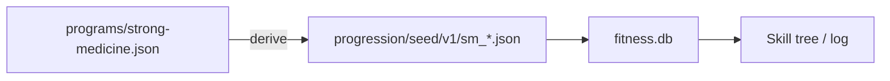

# SPEC-211: Strong Medicine progression seeds

## 1. Target (Outcome)

Strong Medicine resistance ladders from `programs/strong-medicine.json` become real DAG exercises (King Squat → barbell, sumo DL, DB bench/press, statue row, plank core) so skill-tree logging covers tool lifts from that book—not Hub text alone.

**User story:** As a Strong Medicine trainee, I want squat-to-barbell and the other Hub progressions available in progressive logging.

## 2. Boundary (Scope)

### In scope
- Seed JSON under `progression/seed/v1/sm_*.json` derived from Hub movement steps
- Mastery from Hub standards: parse `progression` when sets/reps/holds; otherwise use Hub `intermediate` (official, not invented loads)
- BOOK/FAMILY labels; video series stubs OK
- Tests + README Features

### Out of scope
- Inventing weight prescriptions or hidden steps
- Burst Cardio HIIT session timer / weekly template automation (Hub reference only)
- Changing Hub JSON without book verification

### Files allowed
- `progression/seed/v1/sm_*.json`
- `scripts/generate_sm_seeds.py`
- `progression/seed_loader.py` (metadata notes)
- `progression/video_catalog.py`
- `progression/seed/v1/exercise_videos.json`
- `fitness_programs.py` (BOOK_LABELS / FAMILY_LABELS)
- `tests/**`
- `docs/specs/README.md`, `docs/STATUS.md`, `docs/specs/phase-2/011-strong-medicine-seeds.md`, README, CHANGELOG
- This spec

## 3. Design

Sequential within each family; parallel across SM families.

## 4. Acceptance Criteria

| ID | Criterion |
|----|-----------|
| AC-1 | **When** fitness is seeded, **the** DAG **shall** include SM squat and sumo deadlift ladders matching Hub step names. |
| AC-2 | **The** remaining Hub movements (bench, OHP, row, abs) **shall** each have a sequential seed ladder. |
| AC-3 | **The** system **shall not** invent progression standards absent from the Hub. |
| AC-4 | **Tests** **shall** assert SM counts and updated total seed size. |
| AC-5 | **README** Features **shall** note Strong Medicine skill-tree coverage. |

## 5. Verification

| AC | Method |
|----|--------|
| AC-1–AC-4 | pytest |
| AC-5 | README review |

## 6. Tasks

- [x] T1: Generator + seed files from Hub
- [x] T2: Labels / videos / tests
- [x] T3: Docs; mark done

## 7. Loop

Max 3 retries; then `blocked`.

## 8. Revision History

| Date | Author | Change |
|------|--------|--------|
| 2026-07-19 | agent | Draft from issue #30 after SPEC-210 merge |
| 2026-07-19 | agent | Implement + verify; done |

## 9. AC verification

| AC | Result |
|----|--------|
| AC-1 | `test_sm_seed` squat/DL Hub names |
| AC-2 | Six SM families seeded (25 steps) |
| AC-3 | Generator uses Hub progression or intermediate only |
| AC-4 | Total seed 177 asserted |
| AC-5 | README Features updated |
