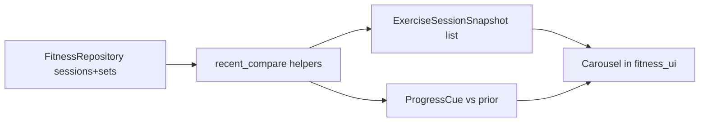

# SPEC-212: Exercise log recent-session carousel

## 1. Target (Outcome)

While logging an exercise, the user can flip through compact cards of recent sessions
(about the past week) for that exercise and see a simple up / flat / down cue vs the
prior session — without opening Graphs.

**User story:** As someone logging a workout, I want to tab through my last few
performances for this exercise while I enter today’s numbers, so I know if I am
progressing without checking a graph.

## 2. Boundary (Scope)

### In scope
- Pure helpers to gather recent per-exercise session snapshots and compare metrics
- Carousel strip in **Log: {exercise}** and **Log Exercise Session** dialogs
- Docs/README for the user-visible behavior

### Out of scope
- New matplotlib charts in the log dialog
- Rewiring program-JSON FitnessHub / `fitness_graphs.py`
- Auto-prefilling today’s fields from a prior session (future ticket OK)

### Files allowed to create/modify
- `docs/specs/phase-2/012-exercise-log-recent-carousel.md`
- `progression/recent_compare.py` (new)
- `progression/db.py` — date-range query helper for carousel
- `fitness_ui.py`
- `tests/test_recent_compare.py` (new)
- `README.md`
- `CHANGELOG.md`
- `docs/architecture.md` (brief module mention if needed)
- `docs/DATA_MODEL.md` (only if documenting compare window constant)

### Files forbidden
- `docs/adr/*`
- `fitness_graphs.py` / unwired `fitness/ui.py` chart path

### Dependencies
- SPEC-208 (workout sessions) done
- No new pip packages

## 3. Design

### Data changes
- None (read-only over existing SQLite sessions/sets)

### UI changes
- Compact LabelFrame with ← / →, “n / N”, card text, progress cue
- Per-exercise log: shown for fixed `exercise_id`
- Multi-exercise session log: updates when picker selection changes

## 4. Acceptance Criteria (EARS)

| ID | Criterion |
|----|-----------|
| AC-1 | **When** the user opens **Log: {exercise}**, **the** dialog **shall** show a recent-sessions carousel for that exercise covering roughly the past 7 days. |
| AC-2 | **When** the user selects an exercise in **Log Exercise Session**, **the** carousel **shall** refresh to that exercise’s recent sessions. |
| AC-3 | **When** prior sessions exist in the window, **the** carousel **shall** let the user navigate ←/→ (or equivalent) without losing set-entry fields. |
| AC-4 | **When** a card has a prior session in the window, **the** system **shall** show an up / flat / down cue using primary metric order weight → reps → hold. |
| AC-5 | **If** no prior sessions exist for the exercise in the window, **then** the system **shall** show a quiet empty state and still allow logging. |
| AC-6 | **The** compare logic **shall** live in pure helpers (no Tk) under `progression/`. |
| AC-7 | **Tests** cover snapshot window filtering, aggregation, and progress cue direction. |

## 5. Verification (Proof)

| AC ID | Verification |
|-------|----------------|
| AC-1 | Manual: Log Selected from hub → carousel present |
| AC-2 | Manual: Log Exercise → pick two exercises → strip updates |
| AC-3 | Manual: ←/→ flips cards; fields remain editable |
| AC-4–7 | `python -m pytest tests/test_recent_compare.py -q` |

## 6. Tasks

- [x] T1: Spec approved / in_progress
- [x] T2: `progression/recent_compare.py` + unit tests
- [x] T3: Mount carousel in both log dialogs; wire picker selection
- [x] T4: README + CHANGELOG (+ architecture one-liner)
- [x] T5: Bugbot → full tests → architect → PR Closes #74

## 7. Loop (Agent retry rules)

- Max 3 retries per task; then `blocked` + ask human.
- Do not invent schema/tables; reuse existing workout sessions/sets.

## 8. Revision History

| Date | Author | Change |
|------|--------|--------|
| 2026-08-03 | agent | Initial approved for #74 workflow |
