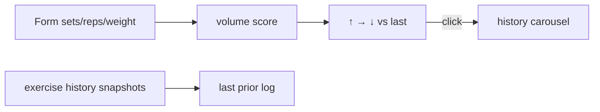

# SPEC-213: Exercise log volume totals vs last log

## 1. Target (Outcome)

While logging an exercise, show whether today’s **combined volume** is up, flat, or down
versus the **last log** of that exercise. Click the cue to browse prior logs (full history
cap, not week-only) and compare totals.

**User story:** As someone logging e.g. 1×11, I want an immediate ↑/→/↓ vs last time and a
detail carousel for fuller comparison — without Graphs.

## 2. Boundary (Scope)

### In scope
- Volume score: sets×reps; with weight → weight×sets×reps; hold-only → sets×hold (or hold)
- Live cue vs last prior log; click → history detail ←/→
- Replace week-first carousel as primary mid-log UX (history not limited to 7 days)
- Fitness Hub log dialogs only

### Out of scope
- Practices UI; month rollups; matplotlib; auto-prefill

### Files allowed
- `docs/specs/phase-2/013-exercise-volume-compare.md`
- `progression/recent_compare.py`
- `progression/db.py`
- `fitness_ui.py`
- `tests/test_recent_compare.py`
- `README.md`, `CHANGELOG.md`, `docs/architecture.md` (brief)

## 3. Design

## 4. Acceptance Criteria

| ID | Criterion |
|----|-----------|
| AC-1 | Volume computed from set rows (aggregated) per DEFINITIONS in #78 |
| AC-2 | Mid-log shows ↑/→/↓ vs immediately previous log of same exercise |
| AC-3 | Cue updates when draft Sets/Reps/Weight/Hold change |
| AC-4 | Click cue opens detail history (date + volume + raw numbers), ←/→ |
| AC-5 | History not limited to 7 days (cap N sessions) |
| AC-6 | Quiet empty when no prior; helpers remain pure in progression/ |
| AC-7 | Unit tests for volume + cue + history |

## 5. Verification

| AC | Method |
|----|--------|
| AC-1–2,5–7 | `pytest tests/test_recent_compare.py` |
| AC-3–4 | Manual smoke both log dialogs |

## 6. Tasks

- [x] T1 Spec
- [x] T2 Engine + db history query
- [x] T3 UI strip + detail dialog
- [x] T4 Docs + pipeline PR

## 7. Loop

Max 3 retries; then blocked.

## 8. Revision History

| Date | Author | Change |
|------|--------|--------|
| 2026-08-07 | agent | Initial for #78 |
