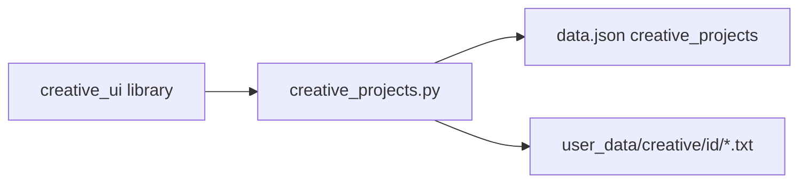

# SPEC-302: Creative Writing Projects Library & Local Storage

## 1. Target (Outcome)

Users can create and manage multiple local creative projects (novels, scripts, ideas). Each project stores metadata plus two long-form documents: an **inspiration/source** document (premise, research, vibe) and a **manuscript/script** document (the work itself). Data survives restart under the existing Integral user-data location.

**User story:** As someone tracking creative work, I want a library of novels/scripts/ideas with room for both premise and draft text, so I can return to projects over weeks without leaving Integral.

## 2. Boundary (Scope)

### In scope
- CRUD for creative projects (create, rename, archive, delete with confirm)
- Project metadata: title, status, optional short notes/tags, timestamps
- Per-project inspiration and manuscript text of unbounded practical length (novel-scale)
- Normalize/load/save integration with existing `data.json` + on-disk document files
- Pure logic module testable without Tkinter
- Minimal library list UI sufficient to create/select projects (full dual-window editor is SPEC-303)

### Out of scope
- Separate Inspiration / Manuscript windows (SPEC-303)
- Creativity category wiring / activity credit (SPEC-304)
- Deep Work Mode (SPEC-305)
- Cloud sync, collaboration, version history / git
- Rich text / markdown preview (plain text only for MVP)
- New pip dependencies

### Files allowed to create/modify
- `creative_projects.py` — domain model, normalize, CRUD, document I/O
- `creative_ui.py` — library list window (create/rename/archive/delete/open hooks)
- `personal_dev_tracker.py` — load/save `creative_projects` key; nav entry to open library
- `paths.py` — helper for creative project document directory under user data
- `tests/test_creative_projects.py` — unit tests
- `docs/DATA_MODEL.md` — document schema
- `docs/architecture.md` — module note
- `README.md` — Features bullet when shipped
- `docs/ROADMAP.md` — checkbox when shipped
- `full-spectrum-development.spec` — hiddenimports for frozen exe
- This spec file (status updates)

### Files forbidden
- `docs/adr/*` (no new ADR unless human requests)
- Fitness / graphs / AI modules
- Changing the eight fixed category names (ADR-005)

### Dependencies
- None (foundation for SPEC-303 / SPEC-304)
- Stdlib only (ADR-001)

## 3. Design

### Architecture



### Data changes

Index in `data.json`:

```json
{
  "creative_projects": {
    "schema_version": 1,
    "projects": [
      {
        "id": "a1b2c3d4e5f6",
        "title": "Working title",
        "status": "drafting",
        "tags": ["novel"],
        "notes": "Optional short blurb",
        "created_at": "2026-07-12T12:00:00",
        "updated_at": "2026-07-12T12:00:00",
        "archived": false
      }
    ]
  }
}
```

Document bodies live **outside** `data.json` to keep novel-length text from bloating daily load:

```
{user_data_dir}/creative/{project_id}/inspiration.txt
{user_data_dir}/creative/{project_id}/manuscript.txt
```

- Status enum: `idea` | `drafting` | `revising` | `done`
- Delete removes index entry and document directory (confirm in UI)
- Archive sets `archived: true`; library default view hides archived (toggle to show)
- Empty documents allowed (new project starts with empty files)

### UI changes
- Footer/nav (or actions bar) button: **Writing Projects**
- Library window: list of projects, New / Rename / Archive / Delete, status filter
- Selecting a project exposes “Open Inspiration” / “Open Manuscript” stubs that SPEC-303 implements; until then, buttons may open simple text editors **or** be disabled with a note — prefer thin placeholders that call into `creative_ui` APIs SPEC-303 will fill

## 4. Acceptance Criteria (EARS)

| ID | Criterion |
|----|-----------|
| AC-1 | **When** the user creates a project with a title, **the** system **shall** persist it in `creative_projects` and create empty inspiration and manuscript files under the user data directory. |
| AC-2 | **When** the user saves inspiration or manuscript text of multi-thousand-character length, **the** system **shall** reload that exact text after app restart. |
| AC-3 | **When** the user archives a project, **the** default library list **shall** hide it until “Show archived” is enabled. |
| AC-4 | **When** the user deletes a project and confirms, **the** system **shall** remove its index entry and document files. |
| AC-5 | **If** no creative projects exist, **then** daily rating + Save flows elsewhere **shall** remain unchanged and unaffected. |
| AC-6 | **When** `data.json` lacks `creative_projects`, **the** loader **shall** normalize to an empty library without error. |

## 5. Verification (Proof)

| AC ID | Verification method |
|-------|---------------------|
| AC-1 | `python -m pytest tests/test_creative_projects.py -k create` |
| AC-2 | pytest round-trip read/write large string; manual: create → type → restart → reopen |
| AC-3 | pytest archive filter; manual library toggle |
| AC-4 | pytest delete removes files; manual confirm dialog |
| AC-5 | Manual: log a category rating + Save with empty library |
| AC-6 | pytest `normalize_creative_projects(None)` / missing key |

### Performance checks
- Loading dashboard with empty creative library must not regress cold start beyond existing budget
- Saving a ~500 KB manuscript must complete without freezing UI longer than ~1s (write on background or after idle if needed)

## 6. Tasks

- [x] T1: Add `creative_projects.py` empty/normalize/CRUD + document path helpers — AC-1, AC-6
- [x] T2: Wire load/save of `creative_projects` index in `personal_dev_tracker.py`; ensure docs dir via `paths.py` — AC-1, AC-2
- [x] T3: Implement inspiration/manuscript file read/write API — AC-2
- [x] T4: Library UI (list + New/Rename/Archive/Delete) — AC-3, AC-4
- [x] T5: Nav entry **Writing Projects** — AC-5
- [x] T6: Tests + docs (`DATA_MODEL`, architecture, README when shipping) — all ACs

## 7. Loop (Agent retry rules)

- If AC fails after implementation, diagnose spec vs code before retrying.
- Max 3 implementation retries per task; then set status `blocked` and ask human.
- May ask human questions when ambiguous; do not guess novel features (e.g. markdown).

## 8. Revision History

| Date | Author | Change |
|------|--------|--------|
| 2026-07-12 | agent | Initial draft from GitHub #1 |
| 2026-07-12 | human | Approved for implementation |
| 2026-07-12 | agent | Implemented; AC-1–6 verified via pytest + py_compile |
