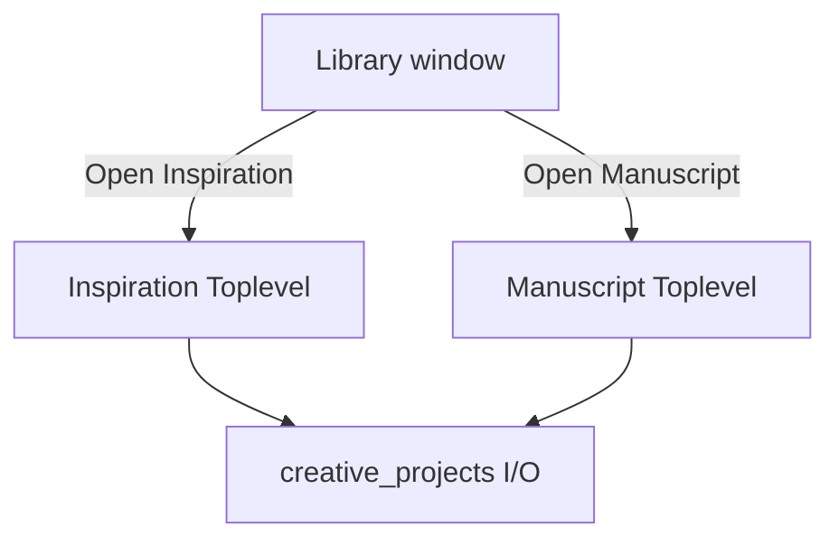

# SPEC-303: Inspiration + Manuscript Writing Windows

## 1. Target (Outcome)

For a selected creative project, the user can open the **inspiration/source** document and the **manuscript/script** in separate Tk windows at the same time, so the premise stays visible while drafting.

**User story:** As a writer, I want the inspiration document open beside the manuscript window, so I can reference premise and research without scrolling away from my draft.

## 2. Boundary (Scope)

### In scope
- Independent Inspiration window and Manuscript window per project
- Plain-text editing with scroll, select, copy/paste
- Save (explicit button) + debounced autosave while typing
- Word/character count in status strip
- Window titles include project title + document role
- Closing one window does not close the other
- Re-open replaces/focuses existing window for that project+role (no duplicate stacks)

### Out of scope
- Project library CRUD (SPEC-302)
- Creativity category activity credit (SPEC-304)
- Deep Work chrome reduction (SPEC-305 may wrap these windows)
- Spellcheck, markdown preview, chapter outline pane
- Multi-user / cloud

### Files allowed to create/modify
- `creative_ui.py` — document windows + open/focus helpers
- `creative_projects.py` — save helpers / dirty tracking helpers if needed
- `personal_dev_tracker.py` — only if wiring save flush on app quit
- `ui_scroll.py` — only if shared scroll helper needed for Text widgets
- `tests/test_creative_ui.py` — non-GUI logic where possible; smoke for open APIs
- `README.md` / `docs/architecture.md` when shipping
- This spec file

### Files forbidden
- Fitness, graphs, encryption modules unless explicitly needed for save-on-quit
- Changing category names

### Dependencies
- **SPEC-302** must be `done` (library + document storage)

## 3. Design

### Architecture

### Data changes
- None beyond SPEC-302 file format
- Optional in-memory dirty flags; flush on Save, autosave, and app close

### UI changes
- Inspiration window: large `tk.Text` (or scrolled text), Save, status “Inspiration · {title}”
- Manuscript window: same pattern, status “Manuscript · {title}”
- Suggested geometry: ~720x900 manuscript, ~640x800 inspiration (user-resizable)
- Font: readable mono or existing theme text font; avoid new font packages
- From library: buttons **Open Inspiration** and **Open Manuscript**

## 4. Acceptance Criteria (EARS)

| ID | Criterion |
|----|-----------|
| AC-1 | **When** the user chooses Open Inspiration for a project, **the** system **shall** show a window containing that project's inspiration text. |
| AC-2 | **When** the user chooses Open Manuscript for the same project, **the** system **shall** show a second window containing the manuscript while the inspiration window may remain open. |
| AC-3 | **When** the user edits and saves (or autosave fires), **the** system **shall** persist text via SPEC-302 document API. |
| AC-4 | **When** the user closes only the inspiration window, **the** manuscript window **shall** remain open and usable. |
| AC-5 | **When** Open Inspiration is chosen again for an already-open project inspiration, **the** system **shall** focus the existing window instead of opening a duplicate. |
| AC-6 | **While** either window is open, **the** UI **shall** remain usable at 1366×768-class laptop resolution (scrollable text area). |

## 5. Verification (Proof)

| AC ID | Verification method |
|-------|---------------------|
| AC-1 | Manual: library → Open Inspiration → text visible |
| AC-2 | Manual: open both; both visible |
| AC-3 | Manual + pytest file write after save API |
| AC-4 | Manual close inspiration; manuscript still edits |
| AC-5 | Manual reopen focuses existing |
| AC-6 | Manual resize / scroll on narrow window |

## 6. Tasks

- [x] T1: Document window factory (role, project_id, load text) — AC-1, AC-6
- [x] T2: Registry to focus existing window per (project_id, role) — AC-5
- [x] T3: Save + debounced autosave wired to creative_projects I/O — AC-3
- [x] T4: Wire library buttons; independent close behavior — AC-2, AC-4
- [x] T5: Flush dirty docs on app quit — AC-3
- [x] T6: Docs / light tests — all ACs

## 7. Loop (Agent retry rules)

- If AC fails after implementation, diagnose spec vs code before retrying.
- Max 3 implementation retries per task; then set status `blocked` and ask human.
- Do not invent rich-text features.

## 8. Revision History

| Date | Author | Change |
|------|--------|--------|
| 2026-07-12 | agent | Initial draft from GitHub #2 |
| 2026-07-12 | human | Approved for implementation |
| 2026-07-12 | agent | Implemented dual windows, debounce autosave, quit flush; tests |
