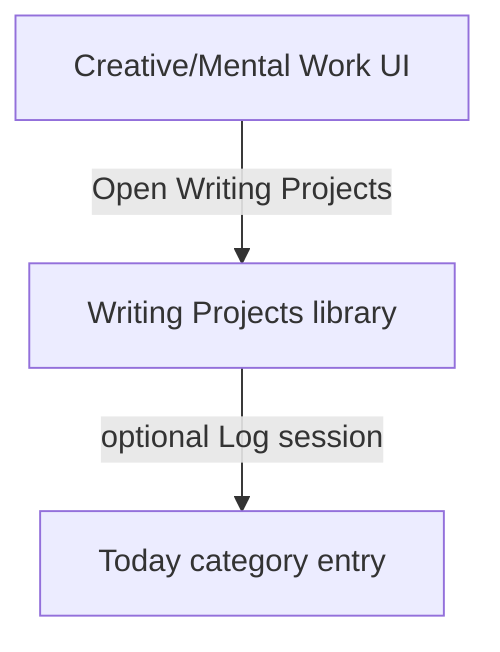

# SPEC-304: Creativity Category Integration for Writing Projects

## 1. Target (Outcome)

Creative writing projects are discoverable from the **Creative/Mental Work** life area (ADR-005 fixed name). Optional low-friction hooks let writing activity contribute to that day's Creativity logging without forcing writing on low-energy days.

**User story:** As someone logging Creative/Mental Work, I want novel/script work reachable from that area and optionally counted toward the day, so my dashboard reflects real creative effort.

## 2. Boundary (Scope)

### In scope
- Entry points from Creative/Mental Work surfaces (log dialog and/or category card / day explorer) to Writing Projects library
- Optional: recording a “writing session” touch for today when user saves manuscript (or explicitly clicks “Log writing session”)
- Optional checklist item or metric already present may be used; **do not rename** the category
- Preserve rating + Save as the minimum daily path

### Out of scope
- New life category or renaming Creative/Mental Work (ADR-005)
- Deep Work Mode (SPEC-305)
- Changing inspiration/manuscript storage (SPEC-302/303)
- Auto-filling ratings without user consent

### Files allowed to create/modify
- `creative_ui.py` — entry helpers / “Log writing session” action
- `creative_projects.py` — optional session timestamp helpers
- `personal_dev_tracker.py` — buttons on Creative/Mental Work log / card; activity credit helper
- `activity_grid.py` — only if writing sessions should appear in day counts (prefer reuse of category entry)
- `storage.py` / seed defaults — only if adding an **optional** checklist string to default Creative/Mental Work (migration-safe append for new installs; existing user categories unchanged unless soft-merge pattern already used)
- `tests/test_creative_integration.py`
- `README.md` Features bullet when shipping
- `full-spectrum-development.spec` — hiddenimports when needed
- This spec file

### Files forbidden
- Renaming any of the eight categories
- Cloud / AI requirements

### Dependencies
- **SPEC-302** `done` (library exists)
- **SPEC-303** preferred `done` (so “open writing” lands in useful UI); may ship with library-only open if 303 delayed

## 3. Design

### Architecture

### Data changes
Preferred approach (minimal schema risk):
- On “Log writing session” (or first manuscript save of the day with user preference default **off** until opted in via button): upsert today's `Creative/Mental Work` entry checklist key `"Made progress on a creative project"` = true if that item exists; do **not** invent a new fixed category
- Optionally set/update a metric if present (`Creativity / output rating` left alone unless user edits)
- Do not auto-set overall rating

Alternative if checklist key missing on older profiles: show messagebox offering to open Writing Projects only (no silent schema mutation)

### UI changes
- On Creative/Mental Work log dialog: button **Writing Projects**
- Optional on dashboard category card context or guidance: same entry
- In writing manuscript window (SPEC-303): button **Log session for today** (explicit)

## 4. Acceptance Criteria (EARS)

| ID | Criterion |
|----|-----------|
| AC-1 | **When** the user is on a Creative/Mental Work surface, **the** system **shall** provide a control that opens Writing Projects in ≤2 clicks from dashboard or category log. |
| AC-2 | **When** the user clicks Log writing session (or equivalent explicit action), **and** the default checklist item for creative progress exists, **the** system **shall** mark that checklist item true for today and persist. |
| AC-3 | **If** the user never opens writing projects, **then** daily logging behavior **shall** be unchanged. |
| AC-4 | **The** system **shall not** rename or replace the Creative/Mental Work category name. |
| AC-5 | **When** this feature ships, **the** README Features section **shall** mention Creativity ↔ writing projects. |

## 5. Verification (Proof)

| AC ID | Verification method |
|-------|---------------------|
| AC-1 | Manual click path from dashboard / log dialog |
| AC-2 | pytest upsert checklist; manual verify day entry |
| AC-3 | Manual log other categories without opening writing |
| AC-4 | Code review / grep category name unchanged |
| AC-5 | README diff in PR |

## 6. Tasks

- [x] T1: Add Writing Projects button on Creative/Mental Work log dialog — AC-1, AC-4
- [x] T2: Implement explicit Log writing session → checklist upsert — AC-2
- [x] T3: Wire button from manuscript window if SPEC-303 present — AC-1, AC-2
- [x] T4: Tests + README — AC-3, AC-5

## 7. Loop (Agent retry rules)

- If AC fails after implementation, diagnose spec vs code before retrying.
- Max 3 implementation retries per task; then set status `blocked` and ask human.
- Never auto-change category names to satisfy AC-1.

## 8. Revision History

| Date | Author | Change |
|------|--------|--------|
| 2026-07-12 | agent | Initial draft from GitHub #3 |
| 2026-07-12 | human | Approved via implement-tickets request |
| 2026-07-12 | agent | Implemented; AC verified via pytest + wiring |
