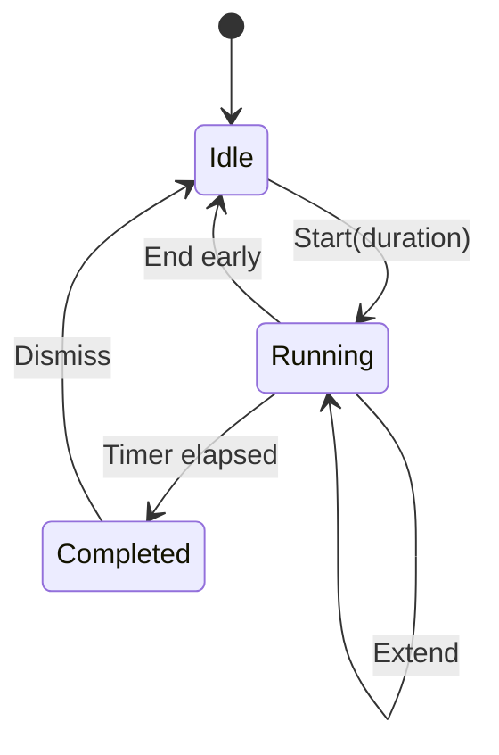

# SPEC-305: Deep Work Mode

## 1. Target (Outcome)

Integral gains an app-wide **Deep Work Mode**: a configurable focus timer that reduces non-essential UI chrome so the user can work with fewer distractions. It works as a general feature and can optionally open a creative writing project’s inspiration + manuscript windows when those specs are available.

**User story:** As someone doing deep work, I want a timed focus session that quiets Integral’s navigation chrome, so I can write or log without constant UI temptation.

## 2. Boundary (Scope)

### In scope (MVP)
- Start Deep Work with presets (25 / 50 / 90 minutes) plus custom minutes
- Visible countdown (dashboard strip and/or floating mini window)
- During session: hide or disable non-essential navigation (Graphs, Export, Backup, Settings, Milestones, multi-hub browsing — exact list in Tasks)
- End early; optional +10 minutes extend
- Local completion signal (status text and/or existing notification helper — no cloud)
- Optional: “Start with Writing Project…” chooser that opens inspiration + manuscript after SPEC-302/303
- Persist last-used duration in settings

### Out of scope
- Killing other OS apps / Focus Assist automation (stretch for later)
- Blocking the user from Force-quitting Integral
- Pomodoro auto-break chaining / multi-interval schedules (single timer MVP)
- Mandatory Creativity dependency — Deep Work must work with writing modules absent
- New pip packages

### Files allowed to create/modify
- `deep_work.py` — timer state machine (pure logic where possible)
- `deep_work_ui.py` — start dialog, countdown chrome, focus overlay helpers
- `personal_dev_tracker.py` — entry button; apply/remove focus chrome; settings key
- `notifications.py` — optional local toast on complete (reuse patterns)
- `creative_ui.py` — optional hook only (open project windows)
- `tests/test_deep_work.py`
- `README.md`, `docs/architecture.md`, `docs/ROADMAP.md` when shipping
- `full-spectrum-development.spec` — hiddenimports
- This spec file

### Files forbidden
- Cloud APIs, telemetry
- Changing ADRs without human approval

### Dependencies
- None hard. Soft: SPEC-302/303 for “start with writing project” option
- May be implemented in parallel with writing specs; writing integration is a separate task behind a feature detect

## 3. Design

### Architecture



### Data changes
In settings (existing settings dict in data.json):

```json
"deep_work": {
  "last_minutes": 50,
  "reduce_chrome": true
}
```

No separate database.

### UI changes
- Nav/actions: **Deep Work** button
- Start dialog: duration presets, custom spinbox, checkbox “Open writing project…” (enabled only if creative library exists)
- While running: banner `Deep Work · MM:SS` with End / +10m; hide agreed chrome buttons
- On complete: messagebox or toast “Session complete”; restore chrome

### Focus chrome policy (MVP)
**Hide/disable while running:** Graphs, Fitness Hub, Milestones, Export, Backup, Edit Categories, Data & Security, theme toggle (optional keep), AI Insight entry points  
**Keep available:** Overview logging path, Journal, Writing Projects (if present), Deep Work End control, window close

## 4. Acceptance Criteria (EARS)

| ID | Criterion |
|----|-----------|
| AC-1 | **When** the user starts Deep Work with a duration, **the** system **shall** show a countdown that reaches zero after that duration (testable with injected clock / short test duration). |
| AC-2 | **While** Deep Work is running, **the** system **shall** hide or disable the non-essential nav controls listed in §3. |
| AC-3 | **When** the user ends early, **the** system **shall** restore normal chrome immediately. |
| AC-4 | **When** the timer completes, **the** system **shall** signal completion locally and restore chrome. |
| AC-5 | **If** creative writing modules are unavailable, **then** Deep Work **shall** still start without error (writing option hidden/disabled). |
| AC-6 | **When** the user opts into “Open writing project” and selects a project (SPEC-302/303 present), **the** system **shall** open inspiration and manuscript windows after start. |
| AC-7 | **The** last-used duration **shall** persist across app restarts. |

## 5. Verification (Proof)

| AC ID | Verification method |
|-------|---------------------|
| AC-1 | `pytest` timer with fake clock / 1–2s duration |
| AC-2 | Manual: start session → Graphs etc. not clickable/hidden |
| AC-3 | Manual End early |
| AC-4 | Manual or pytest completion callback |
| AC-5 | Manual/pytest with creative import guarded |
| AC-6 | Manual with a project from SPEC-302/303 |
| AC-7 | pytest settings round-trip; manual restart |

## 6. Tasks

- [x] T1: `deep_work.py` timer state (start/tick/complete/cancel/extend) — AC-1
- [x] T2: Start dialog + settings persistence — AC-7
- [x] T3: Apply/remove chrome policy on tracker — AC-2, AC-3, AC-4
- [x] T4: Completion signal via UI + optional notification — AC-4
- [x] T5: Soft integration with creative open — AC-5, AC-6
- [x] T6: Tests + docs — all ACs

## 7. Loop (Agent retry rules)

- If AC fails after implementation, diagnose spec vs code before retrying.
- Max 3 implementation retries per task; then set status `blocked` and ask human.
- Do not implement OS-wide app blocking in MVP.

## 8. Revision History

| Date | Author | Change |
|------|--------|--------|
| 2026-07-12 | agent | Initial draft from GitHub #4 |
| 2026-07-12 | human | Approved via implement-tickets request |
| 2026-07-12 | agent | Implemented timer, chrome policy, writing open option |
