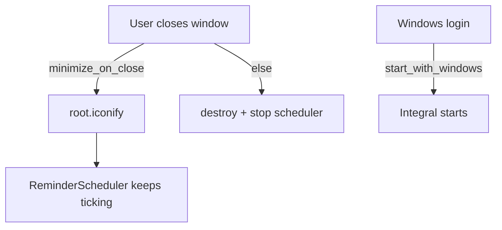

# SPEC-306: Windows reminder residency for portable Integral

## 1. Target (Outcome)

Users understand that Windows reminders only fire while Integral is running, and can opt into **Start with Windows** plus **minimize on close** so the process stays alive for toasts without a full installer or new pip dependencies.

**User story:** As a Windows user of the portable exe, I want reminders to keep working after I “close” the window (and optionally at login), or a clear explanation of why they do not.

## 2. Boundary (Scope)

### In scope
- Settings: `notifications.start_with_windows`, `notifications.minimize_on_close`
- HKCU Run key toggle for Start with Windows (frozen exe path or `pythonw`/`python` + script in dev)
- Close button / window X: when minimize_on_close, iconify instead of destroy; Quit available from Data & Security or confirm dialog
- Data & Security (or notifications section): toggles + “Send test notification” + short explanation
- README Features / notes on portable reminder behavior

### Out of scope
- System tray icon / pystray (new dependency — future ADR)
- MSI installer / Start Menu AppUserModelID registration
- Separate reminder helper process
- Non-Windows platforms (no-ops / hide toggles)

### Files allowed to create/modify
- `docs/specs/phase-3/006-notification-residency.md` — this spec
- `notifications.py` — settings normalize + test helpers
- `autostart_windows.py` — enable/disable/query Run key (stdlib `winreg`)
- `integral_dialogs.py` — Data & Security UI for reminders/residency
- `personal_dev_tracker.py` — close behavior, wire settings
- `tests/test_autostart_windows.py`, `tests/test_notifications.py`
- `README.md`, `docs/architecture.md`, `docs/ROADMAP.md`, `docs/specs/README.md`
- `full-spectrum-development.spec` — hiddenimports if needed

### Dependencies
- Stdlib only (`winreg` on Windows)

## 3. Design

## 4. Acceptance Criteria (EARS)

| ID | Criterion |
|----|-----------|
| AC-1 | **When** minimize_on_close is enabled and the user closes the main window, **the** app **shall** minimize (remain running) instead of exiting. |
| AC-2 | **When** start_with_windows is enabled on Windows, **the** HKCU Run key **shall** point at the current Integral launch command; disabling removes it. |
| AC-3 | **When** the user clicks Send test notification, **the** app **shall** attempt a Windows toast (or show a clear failure message). |
| AC-4 | **The** Data & Security (or equivalent) UI **shall** explain that reminders require Integral to be running / minimized. |
| AC-5 | **README** **shall** document portable reminder behavior and the two options. |

## 5. Verification

| AC | Method |
|----|--------|
| AC-1 | Manual: enable minimize on close → X → process still in taskbar; reminders still scheduled |
| AC-2 | pytest with mocked winreg; manual registry check |
| AC-3 | Manual test button |
| AC-4 | Manual UI copy |
| AC-5 | README review |

## 6. Tasks

- [x] T1: Spec + settings keys in normalize_notification_settings
- [x] T2: autostart_windows.py + tests
- [x] T3: Close → iconify / quit path in tracker
- [x] T4: Data & Security UI + test toast
- [x] T5: README / architecture / mark done

## 7. Loop

Max 3 retries; then `blocked`.

## 8. Revision History

| Date | Author | Change |
|------|--------|--------|
| 2026-07-12 | agent | Initial spec from GitHub #15; implementing per human request |
| 2026-07-12 | agent | Implemented minimize-on-close + Start with Windows + docs |