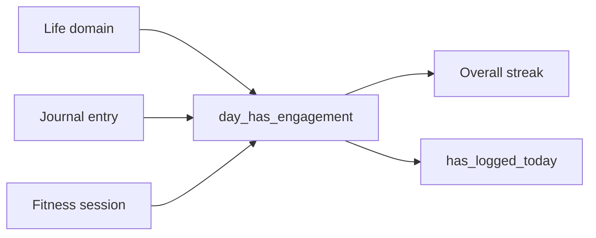

# SPEC-307: Engagement streak + immediate feedback

## 1. Target (Outcome)

Overall streak counts any honest daily engagement—life domain log, journal entry, or fitness session—and updates the header pill as soon as that engagement is saved. Reminders use the same “logged today” definition.

**User story:** As a user, I want showing up in Integral (not only a life-domain rating) to count toward my streak immediately, so I am not discouraged after I already used the tool.

## 2. Boundary (Scope)

### In scope
- Overall streak day = ≥1 life category **or** ≥1 journal entry (non-empty body) **or** ≥1 fitness session
- Shared engagement helper used by streak + `has_logged_today`
- Wire journal/sessions into streak calculation; journal save notifies reminder scheduler for today
- Mid-day grace unchanged; category streaks life-domain only
- Docs: DATA_MODEL + README Features

### Out of scope
- Freeze tokens / streak shops (SPEC-308 covers human gap repair UX)
- Counting writing autosave without “Log writing session”
- Changing category streak rules

### Files allowed to create/modify
- `docs/specs/phase-3/007-streak-any-engagement.md`
- `streak.py`
- `activity_grid.py` (align counts if needed)
- `personal_dev_tracker.py`
- `journal_ui.py`
- `tests/test_storage.py` and/or `tests/test_streak.py`
- `docs/DATA_MODEL.md`, `README.md`, `docs/specs/README.md`, `docs/architecture.md` (if needed)

### Dependencies
- None beyond existing journal / sessions data

## 3. Design

## 4. Acceptance Criteria (EARS)

| ID | Criterion |
|----|-----------|
| AC-1 | **When** only a non-empty journal entry exists for today, **the** overall streak **shall** be at least 1. |
| AC-2 | **When** only a fitness session exists for today, **the** overall streak **shall** be at least 1. |
| AC-3 | **When** a life domain is logged today after a gap yesterday, **the** overall streak **shall** be at least 1. |
| AC-4 | **While** today has no engagement, **the** streak **shall** still count consecutive days ending yesterday (grace). |
| AC-5 | **When** computing a category streak, **the** system **shall** ignore journal and fitness (life entries only). |
| AC-6 | **When** the user saves a journal entry for today, **the** reminder scheduler **shall** treat today as logged. |
| AC-7 | **When** engagement is saved for today, **the** streak pill **shall** refresh without restarting the app. |

## 5. Verification

| AC | Method |
|----|--------|
| AC-1–AC-5 | `python -m unittest tests.test_streak -v` (or test_storage streak cases) |
| AC-6–AC-7 | Manual: save journal → pill + reminder state; code review of notify path |

## 6. Tasks

- [x] T1: `day_has_engagement` + extend `get_streak`
- [x] T2: Wire tracker `get_streak` / `has_logged_today` / journal notify
- [x] T3: Tests
- [x] T4: Docs + mark done

## 7. Loop

Max 3 retries; then `blocked`.

## 8. Revision History

| Date | Author | Change |
|------|--------|--------|
| 2026-07-12 | agent | Draft from plan; implementing per human request (issues #18) |
| 2026-07-12 | agent | Implemented engagement streak + tests; verified AC-1–AC-5 via pytest |
