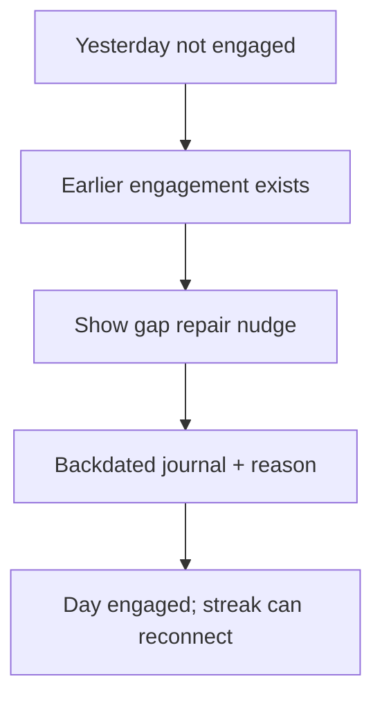

# SPEC-308: Human gap repair via journal

## 1. Target (Outcome)

When a calendar day was missed, the user can restore streak continuity by writing a journal entry **dated for that day** (with existing backdate honesty rules). Light UX copy points them there—no freeze tokens.

**User story:** As a user, I want to reconnect my streak by honestly journaling what got in the way on the missed day, so repair is human accounting rather than gamification.

## 2. Boundary (Scope)

### In scope
- Gap repair = missed day becomes engaged via journal (depends on SPEC-307 counting journal days)
- Reuse `validate_backdate` / `MIN_BACKDATE_REASON_LEN`
- Gap prompt preset: “What got in the way of logging?”
- Light nudge when yesterday has no engagement but prior days did (guidance / streak area; not a shop modal)
- Shortcut to open journal for yesterday with gap prompt
- Journal bodies that count remain non-empty (already enforced)

### Out of scope
- Freeze currency, hearts, paid repair, auto-restore without writing
- New schema flags for “repair” entries

### Files allowed to create/modify
- `docs/specs/phase-3/008-journal-gap-repair.md`
- `streak.py` — gap hint helper
- `journal.py` — gap prompt in DEFAULT_PROMPTS
- `journal_ui.py` — optional initial prompt; gap-friendly copy
- `personal_dev_tracker.py` — nudge UI + open journal for yesterday
- `tests/test_streak.py`
- `docs/DATA_MODEL.md`, `README.md`, `docs/specs/README.md`

### Dependencies
- SPEC-307 done (journal days count toward overall streak)

## 3. Design

## 4. Acceptance Criteria (EARS)

| ID | Criterion |
|----|-----------|
| AC-1 | **When** a non-empty journal is saved for a previously empty gap day (with valid backdate reason), **the** overall streak **shall** treat that day as engaged. |
| AC-2 | **When** yesterday has no engagement but an earlier day within 14 days does, **the** dashboard **shall** show a short gap-repair nudge (not a freeze shop). |
| AC-3 | **The** journal prompts list **shall** include “What got in the way of logging?” |
| AC-4 | **When** the user chooses the gap-repair action, **the** journal window **shall** open for yesterday with the gap prompt selected. |
| AC-5 | **The** system **shall not** introduce freeze tokens or auto-restore without a written journal. |

## 5. Verification

| AC | Method |
|----|--------|
| AC-1 | unittest: gap day journal reconnects streak |
| AC-2–AC-4 | unittest for hint helper + manual UI |
| AC-5 | Spec/code review |

## 6. Tasks

- [x] T1: Gap hint helper + tests
- [x] T2: Prompt + journal_ui initial prompt
- [x] T3: Dashboard nudge + open yesterday journal
- [x] T4: Docs + mark done

## 7. Loop

Max 3 retries; then `blocked`.

## 8. Revision History

| Date | Author | Change |
|------|--------|--------|
| 2026-07-12 | agent | Draft from plan; implementing per human request (issues #19) |
| 2026-07-12 | agent | Implemented gap nudge, GAP_PROMPT, backdated journal reconnect tests |
