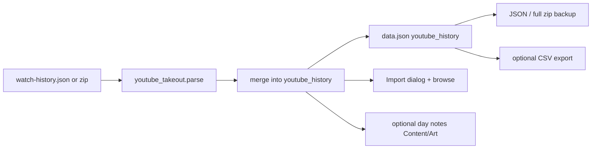

# SPEC-328: YouTube Takeout import

## 1. Target (Outcome)

Integral can import a user's **YouTube watch history** from a free **Google Takeout**
export (`watch-history.json`, optionally inside a zip). Watches are stored locally,
browsable, included in backup/export, and optionally rolled up as day notes for
**Content You Have Consumed** / **Art You Have Consumed** (YouTube Music) — without
auto-setting honesty ratings and without any Google/YouTube API or paid service.

**User story:** As a local-first user, I want to import my Takeout watch history so
Integral can reflect what I watched, without connecting a YouTube account or paying
for an API.

## 2. Boundary (Scope)

### In scope
- Parse Takeout `watch-history.json` (and zip containing that path)
- Local persistence of watch events + dedupe on re-import
- Import UI entry point under Data & Security (or Backup/Import adjacent)
- Simple browse / recent list of imported watches
- Optional per-day rollup text into Content / Art notes (user-confirm or non-destructive append)
- Backup / restore / CSV export continuity
- Docs: Takeout steps + README Features bullet
- Unit tests with fixture JSON

### Out of scope
- OAuth / YouTube Data API / “Connect account”
- Live or scheduled sync
- Scraping youtube.com
- Inferring video duration or categories beyond Music vs Watch
- Changing default life-category schemas
- Auto-filling 1–10 ratings or checklist items

### Files allowed to create/modify
- `youtube_takeout.py` — parse, normalize, merge, rollup helpers (new)
- `personal_dev_tracker.py` — load/save payload field; wire import action if needed
- `integral_dialogs.py` — Import YouTube Takeout UI + browse panel
- `integral_io.py` — CSV export of youtube history when present
- `backup.py` — only if a sidecar file is chosen (prefer payload key first)
- `docs/DATA_MODEL.md` — document `youtube_history` shape
- `docs/INPUT_AND_CONSUMPTION_COMPARISON.md` — note Takeout import vs scrobblers (brief)
- `README.md` — Features bullet
- `docs/architecture.md` — one-line module mention if layout changes
- `docs/specs/README.md` — index SPEC-328
- `tests/test_youtube_takeout_82.py` — parser, dedupe, rollup, roundtrip
- `tests/fixtures/youtube_watch_history_sample.json` — small Takeout-shaped fixture
- `tests/test_integral_io.py` / `tests/test_backup.py` — only if CSV/backup hooks need asserts

### Files forbidden
- `docs/adr/*` unless a superseding ADR is explicitly requested
- Network clients, OAuth, API key config
- Changes to fitness / creative manuscript paths unrelated to backup listing

### Dependencies
- None (stdlib JSON + zipfile only)
- No new pip packages

## 3. Design

### Architecture



### Data changes

Top-level payload key `youtube_history`:

```json
{
  "schema_version": 1,
  "events": [
    {
      "id": "sha1-of-url|watched_at",
      "watched_at": "2024-06-01T12:34:56.000Z",
      "title": "Video title",
      "url": "https://www.youtube.com/watch?v=…",
      "channel": "Channel name",
      "source": "youtube" | "youtube_music" | "other"
    }
  ],
  "last_import_at": "ISO-8601",
  "last_import_stats": {"added": 12, "skipped": 3, "unparsed": 0}
}
```

- Prefer storing in `data.json` for backup continuity (v1). If fixture/perf proves
  pathological, amend spec to move to a profile sidecar + `PROFILE_ARTIFACTS`.
- `source`: map Takeout `header` containing “YouTube Music” → `youtube_music`;
  “YouTube” watch → `youtube`; else `other`.
- Rollup mapping: `youtube_music` → **Art You Have Consumed** notes; other watches →
  **Content You Have Consumed** notes. Append/update a dated summary line only when the user
  opts in at import time **and** that category was already logged for the day (never create
  notes-only day entries that would inflate streaks). Replaces the Takeout marker line only;
  never sets ratings.

### UI changes
- Data & Security: button **Import YouTube Takeout…**
- File dialog accepts `.json` / `.zip`
- After import: message with added/skipped/unparsed counts + short Takeout reminder
- Optional checkbox: “Append daily watch summaries to Content / Art notes”
- Lightweight **YouTube history** list (recent first, scrollable) opened from the same area

### Copy (Takeout how-to, short)
Point users to Google Takeout → deselect all → YouTube and YouTube Music → History →
JSON → download → pick file in Integral. No API keys.

## 4. Acceptance Criteria (EARS)

| ID | Criterion |
|----|-----------|
| AC-1 | **When** the user selects a valid Takeout `watch-history.json` (or zip containing it), **the** system **shall** import watch events with title, URL, timestamp, and channel when present. |
| AC-2 | **When** the same file (or overlapping events) is imported again, **the** system **shall** skip duplicates keyed by URL + `watched_at` and report added vs skipped counts. |
| AC-3 | **The** system **shall not** set or overwrite daily category ratings or checklist values as a result of import. |
| AC-4 | **If** the user enables day rollup, **then** the system **shall** append/update non-destructive summary lines on Content / Art notes only for dates where that category was already logged (Music → Art; other → Content), without creating new day-category entries. |
| AC-5 | **When** JSON backup or full zip backup is restored, **the** `youtube_history` data **shall** round-trip. |
| AC-6 | **When** CSV export runs and history exists, **the** export **shall** include a YouTube history CSV (or dedicated section/file). |
| AC-7 | **The** import path **shall** perform no network I/O and require no API keys. |
| AC-8 | **README Features** **shall** mention Takeout YouTube import; docs **shall** include brief Takeout steps. |

## 5. Verification (Proof)

| AC ID | Verification method |
|-------|---------------------|
| AC-1 | `pytest tests/test_youtube_takeout_82.py -k parse` + fixture |
| AC-2 | `pytest … -k dedupe` |
| AC-3 | Unit assert rollup/import does not mutate `rating` / checklist |
| AC-4 | Unit assert notes append only when flag True; Music → Art |
| AC-5 | Extend or call backup/io roundtrip covering `youtube_history` |
| AC-6 | Assert CSV helper emits history rows |
| AC-7 | Code review: no urllib/requests/oauth in `youtube_takeout.py` |
| AC-8 | Manual/README diff check in PR |

### Performance checks
- Import of a ~5k-event fixture completes without freezing UI longer than a progress/busy message (parse off main path or show brief wait). Matplotlib remains lazy.

## 6. Tasks

- [x] T1: Add `youtube_takeout.py` parse + normalize + merge — AC-1, AC-2, AC-7
- [x] T2: Persist `youtube_history` on tracker payload load/save — AC-5
- [x] T3: Import + browse UI in `integral_dialogs.py` — AC-1, AC-2
- [x] T4: Optional day-note rollup — AC-3, AC-4
- [x] T5: CSV export + backup coverage — AC-5, AC-6
- [x] T6: Fixture + `tests/test_youtube_takeout_82.py` — AC-1–4, AC-7
- [x] T7: README + DATA_MODEL (+ brief consumption doc note) — AC-8

## 7. Loop (Agent retry rules)

- If AC fails, diagnose spec vs code before retrying.
- Max 3 implementation retries per task; then set status `blocked` and ask human.
- Large Takeout files that bloat `data.json` → propose sidecar amendment before shipping.

## 8. Revision History

| Date | Author | Change |
|------|--------|--------|
| 2026-09-02 | agent | Initial draft from #82 Takeout decision |
| 2026-09-02 | human/agent | Approved for implementation (#82) |
